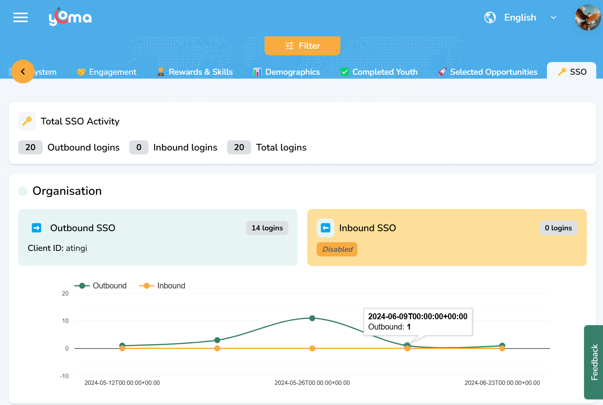
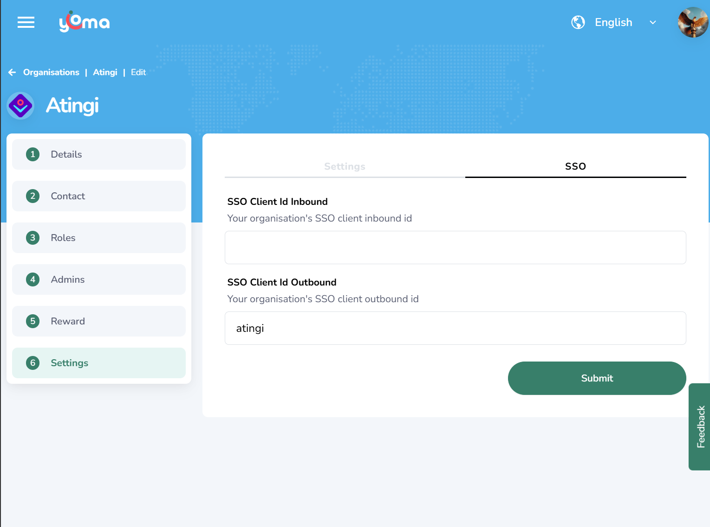

# 🔑 Single Sign-On (SSO) Integration Guide

## 🌟 Overview

Simplify your login process with Yoma SSO integration! Partners can now integrate Yoma credentials into their websites for seamless access. With single sign-on, users only need one account to log in, making it easier and more secure to manage access across platforms.



## 🚀 Getting Started

To opt-in for SSO integration:

1. Contact Yoma Support to request integration
2. Receive your unique client ID for OAuth authentication
3. Configure your platform using the instructions below
4. Gain access to track login activity on your organization's dashboard

## ⚙️ Configuration Process

### 1️⃣ Request a Client ID

When reaching out to Yoma Support, include the following information:

- **CLIENT_URL**: The URL of your site (e.g., https://www.example.com)
- **CLIENT_URL_REDIRECT**: The redirect URI for handling authentication (e.g., exampleauth://yomaredirect)

This ensures Support can generate a client ID tailored to your setup.

### 2️⃣ Set Up the OAuth Redirect URI

Specify a redirect URI that will handle the authentication response on your platform. Ensure this URI matches the one you provided when requesting the client ID.

### 3️⃣ Authentication URL

Use the following authentication URL:

#### STAGE Environment:

```
https://stage.yoma.world/auth/realms/yoma/protocol/openid-connect/auth
```

#### PROD Environment:

```
https://yoma.world/auth/realms/yoma/protocol/openid-connect/auth
```

### 4️⃣ Define Parameters

Include these parameters in your authentication URL:

| Parameter       | Value                                 | Description                               |
| --------------- | ------------------------------------- | ----------------------------------------- |
| `client_id`     | Your assigned ID                      | The client ID provided by Yoma Support    |
| `redirect_uri`  | Your redirect URI                     | The URI handling authentication responses |
| `response_type` | `code`                                | The type of response expected             |
| `scope`         | `openid email profile yoma-api phone` | The data access being requested           |

### 5️⃣ Update OAuth Configuration

In your platform's authentication settings, add the client ID, redirect URI, and authentication URL. Refer to your platform's documentation for specific configuration steps.

## 🧪 Testing Your Integration

This testing process applies to the STAGE environment (for PROD, remove the `.stage` prefix from URLs):

1. Open Tab 1 at the following URL (login page):

   ```
   https://stage.yoma.world/auth/realms/yoma/protocol/openid-connect/auth?client_id=[your_clientId]&redirect_uri=[your_redirect_uri]&response_type=code&scope=openid+email+profile+yoma-api+phone
   ```

2. Open Tab 2 at this URL (opportunity page):

   ```
   https://v3app.stage.yoma.world/opportunities/24f87c7c-fce2-4343-be7e-5c773ebc5483
   ```

3. Ensure you are logged out of Yoma
4. Log in on Tab 1
5. Refresh Tab 2

**Expected Behavior**: The "Sign In" button should still appear, not your profile button.

## 🔧 Auth URL Configuration

In your authentication setup, use this URL structure:

```
../auth
```

Replace `[your_clientId]` and `[your_redirect_uri]` with your actual values.

## 👨‍💼 Administrator Notes

- Once the Keycloak client ID is configured, you can update the outbound client ID in your administrative dashboard
- **Important**: Inbound SSO (letting users log in to Yoma using third-party credentials) is reserved for future use and is not recommended at this time



## 📚 Documentation

For more details on architecture, design decisions, and component guidelines, please refer to our [documentation](../../docs/README.md).
