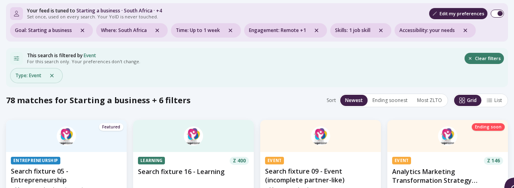
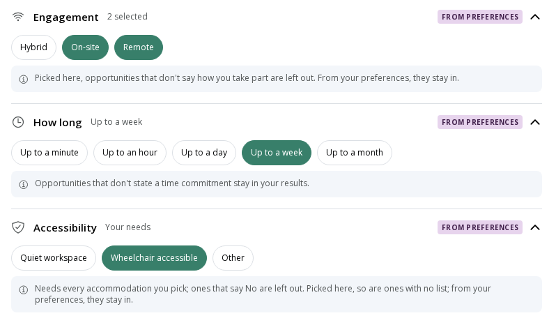
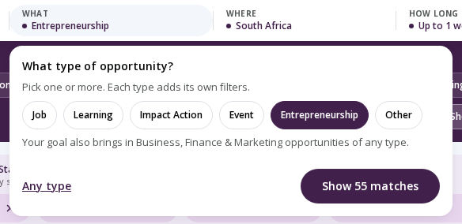
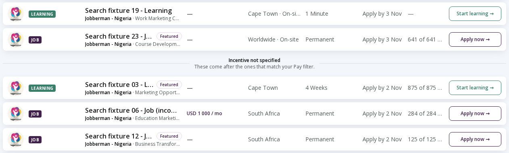
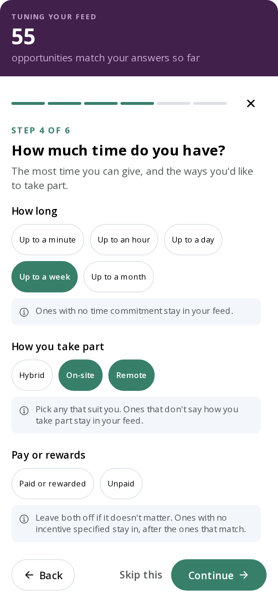
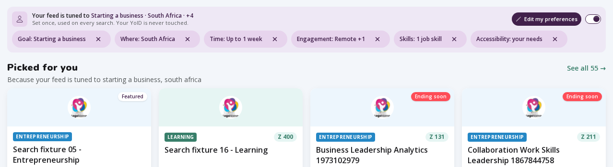
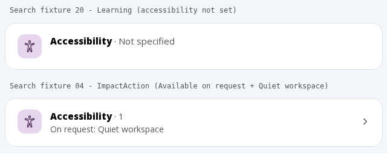
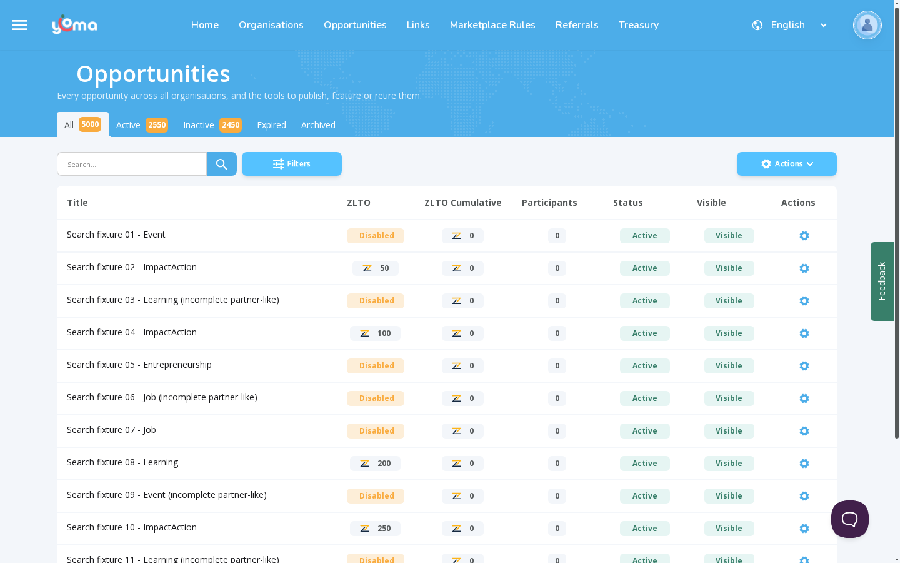
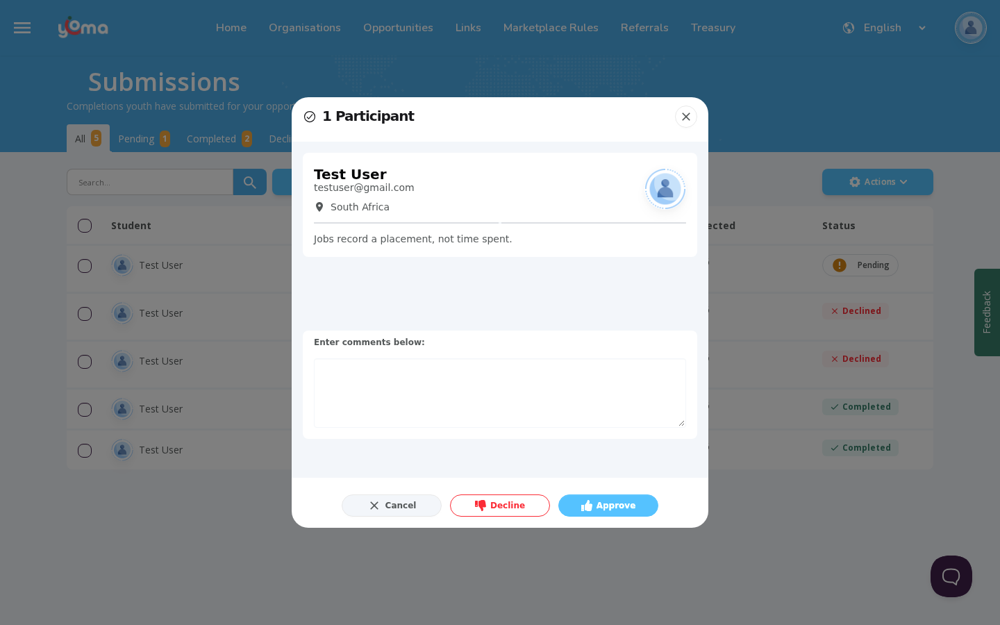

# Testing guide: opportunity search, preferences, filters, details and admin (2026-10-03)

**Status:** Draft for BA review. Decisions marked **TBC** need confirmation.

This guide is for the Business Analyst (BA) and the testers. It explains, in plain words, how Yoma's new opportunity search works. It covers the youth's saved preferences, the filters, the opportunity details page and the admin pages that changed. Use it in three ways:

- **To review:** read sections 1, 4, 7 and 8. Section 7 lists every decision we made and says where it differs from the BA sheet. Section 8 lists open questions.
- **To discuss:** each rule in section 4 has a worked example with real numbers you can check on screen.
- **To test:** run the quick start (section 5), then the numbered tests in section 6. Tick a box on each "Result" line.
- **To give answers or results:** see 2.8.

**Planning a test pass.** There are 68 tests plus the smoke test, most of them at two widths. A full pass has not been timed yet, so plan three sessions and adjust after the first: **Session 1** sections 5, 6.1, 6.2 and 6.3; **Session 2** 6.4 and 6.5; **Session 3** 6.6 and 6.8, then 6.7 (the editor tests always run last, because they add opportunities that change counts). Signed-in tests need testuser to yourself (2.2). Check fixture 08's date first (2.5).

The guide describes the app as it is on Jason's computer on 3 October 2026. That includes changes made that day that are not yet committed or deployed (see 2.1). Every fact has a source the dev team can check: next to the fact, or in Appendix B.

---

## Contents

1. [What changed](#1-what-changed)
2. [Before you start](#2-before-you-start)
3. [Key terms](#3-key-terms)
4. [How preferences and filters work together](#4-how-preferences-and-filters-work-together)
5. [Quick start: a 15-minute smoke test](#5-quick-start-a-15-minute-smoke-test)
6. [Test scripts by area](#6-test-scripts-by-area)
   - [6.1 Search and results (SR)](#61-search-and-results-sr)
   - [6.2 Preferences (PR)](#62-preferences-pr)
   - [6.3 Filters (FI)](#63-filters-fi)
   - [6.4 Provenance rules, with worked examples (PV)](#64-provenance-rules-with-worked-examples-pv)
   - [6.5 Opportunity details page (DP)](#65-opportunity-details-page-dp)
   - [6.6 Admin and organisation pages (AD)](#66-admin-and-organisation-pages-ad)
   - [6.7 Admin editor: data entry (ED)](#67-admin-editor-data-entry-ed)
   - [6.8 The old search page (LG)](#68-the-old-search-page-lg)
7. [Decisions to confirm (TBC)](#7-decisions-to-confirm-tbc)
8. [Open questions and suggestions](#8-open-questions-and-suggestions)
9. [Known issues and out of scope](#9-known-issues-and-out-of-scope)
- [Appendix A: fixture cheat sheet](#appendix-a-fixture-cheat-sheet)
- [Appendix B: for the dev team](#appendix-b-for-the-dev-team)

---

## 1. What changed

Yoma has a new opportunity search page, called the **discovery page**, at `/opportunities/discover`. The top-menu link "Opportunities" now opens it. The older search page at `/opportunities` (the **legacy page**) still works, and several other links still go there.

1. **Preferences shape every search, and you can see it.** A youth can answer six short steps of questions (a **wizard**) about what they want: their goal, interests, skills, time, how they take part, pay, where they are, languages and accessibility needs. These answers are their **preferences**. Every search starts already narrowed by them. Each preference shows as a small purple label (a **chip**) in a purple strip above the results. The youth can switch one off, or all of them, for one search only. Nothing saved changes unless they choose to save it.
2. **Two colours, two sources.** Purple means "this comes from your preferences". Green means "you picked this for this search". This difference is called **provenance** (where a value came from). The colours apply to the chips and the search-bar values. Inside the Filters panel, a selected option is always green (on the Type row, always purple), wherever it came from. There, the "FROM PREFERENCES" tag shows the source.
3. **Clear rules for missing data.** Many opportunities leave fields empty, for example partner jobs that don't say whether they are remote. We call these **opportunities that don't say** (or "not specified"). Each filter now says, in one grey line, whether it **keeps** or **leaves out** opportunities that don't say. For some filters it depends on provenance: a value from your preferences keeps them, but a value you pick yourself leaves them out, unless it repeats one you saved (see 4.2).
4. **New on 3 October 2026 (the move to the API's revised search):**
   - Sort is back: "Newest", "Ending soonest" and "Most ZLTO". "Most ZLTO" is hidden when only Jobs are searched.
   - With a Pay filter, opportunities that don't say whether they pay come after the ones that match, below an "Incentive not specified" line (the **divider**).
   - Saved accessibility needs now narrow the results, and they are private: the chip only ever says "Accessibility: your needs".
   - The "Start a business" goal now brings in the Entrepreneurship type *or* the Business, Finance & Marketing category.
   - Your home country now also brings in opportunities open "Worldwide".
   - "How you take part" (engagement) can have several answers again.
   - Every filter's grey rule line was rewritten. The Provider filter now leaves out opportunities that name no provider. A time limit now keeps opportunities that state no time.
   - Opportunities past their end date disappear from youth search at once.
5. **The details page** uses a new tabbed layout. Accessibility always has an entry. An "on request" list reads "On request: …", so the page never claims a provider already meets a need.
6. **Admin changes:**
   - The numbers on the admin status tabs are fetched a faster way. They should still match the lists (AD-02).
   - Reviewing a Job completion no longer shows start and finish times.
   - The completion import help and sample file were updated.
   - The old search and the admin lists now follow the API's default rules. For example, picking "Remote" on the old page now leaves out opportunities that don't say.

Sources: YOM-1262 `feature.md` Decisions 2026-09-22 to 2026-10-03; handoff `2026-10-03-a.md`; design spec `2026-10-03-search-contract.md`.

---

## 2. Before you start

### 2.1 Where to test

- **The local stack runs on Jason's computer.** The local stack is the full app: the website at http://localhost:3000 and the API at http://localhost:5000. Test at that computer, or over a screen-share with Jason. http://localhost:3000 will not open on your own laptop. If you need your own copy, the dev team sets it up (a seeded database, plus a "keycloak" entry in the computer's hosts file so "Login" works). Don't start, stop or restart the servers yourself.
- **Not on DEV yet.** DEV (https://dev.yoma.world) is a shared test site. Whoever deploys last wins there, so its website and API can be from different branches. Today's changes are not committed or deployed, and they need a matching API on DEV. The dev team will say when it's ready. Until then, any error or empty result on DEV is an environment problem, not a bug.
- **When the dev team says DEV is ready:**
  - use https://dev.yoma.world in place of http://localhost:3000;
  - ask the dev team which accounts to use on DEV;
  - fixture dates come from DEV's own seed time, so check which fixtures have ended before trusting counts;
  - totals marked *(seed)*, such as "1 426 opportunities", will differ;
  - skip the distance tests until Q-A08 is closed.
- **First loads are slow locally.** The first time you open any page, it can take 10 to 45 seconds. That is not a bug.
- **A monitoring box may pop up** on your first visit ("Not Now" / "Allow Monitoring"). Click "Not Now".

Sources: handoff 2026-10-03-a "Next Steps"; epic README "DEV environment skew"; `src/web/AGENTS.md` "Local stack".

### 2.2 Test accounts

| Role | Account name | Used for |
|---|---|---|
| Youth | testuser@gmail.com | Signed-in search and preferences |
| Organisation admin ("org admin") | testorgadminuser@gmail.com | Manages every seeded organisation |
| Admin (Yoma platform admin) | testadminuser@gmail.com | Admin lists, Treasury, any organisation |

- **Passwords are never written down.** Ask the dev team for the password. Never put a password in notes, screenshots or tickets.
- **Sign in only through the site's "Login" button.** On phones the button shows an icon only. To sign out, use the avatar menu.
- **These accounts are shared.** Pressing "Finish" in the wizard, "Keep my answers" or "Make this my default" while signed in changes the account for everyone.
- **Set testuser up before any signed-in test.** testuser's saved "Remote" is **not** part of the seed: it was set by hand, so a reseed (2.5) leaves testuser with nothing saved (and the welcome may then open on its own). On DEV, don't assume it is there either. Before signed-in tests: sign in, open the avatar menu, "My preferences", make sure step 4 has only "Remote" and nothing else is picked on any step, then press "Finish". Put it back the same way when you finish.
- **One tester at a time on testuser.** Tests that read or change its preferences (SR-01, PR-01, PR-03, PR-05, PR-07, PR-08 and PV-11) give wrong results if someone else is using it at the same time (Q-W23).
- **Signed in as testuser you also see** "Where: South Africa" (profile country), "Age: 20 years" (from the date of birth) and a Skills chip for earned skills. These come from the profile, not the wizard.
- **Don't change shared data** unless a test tells you to. Never press "Approve", "Decline" or "Submit" on seeded records. Make your own test opportunities instead (6.7).

Sources: `src/web/AGENTS.md` "Local data"; handoff 2026-10-03-a "Current State"; `post.sql` (testuser profile and verified skills; the fixture block says "no user location/preferences are seeded").

### 2.3 Starting fresh

- **Private windows share sign-in and saved browser data while any private window is open.** This is true in Chrome, Edge and Firefox. So, before each fresh start, close **all** private windows, then open a new one. After any signed-in step, close every private window (or sign out) before the next signed-out test.
- **A fresh private window** starts signed out, with nothing saved. The welcome screen opens by itself.
- **Signed-out answers live only in that one browser tab.** Stay in the same tab during a test.
- **The welcome opens by itself only once per browser session.** To see it again, close all private windows and open a new one.
- **Signed-in preferences are saved on the server.** Clearing the browser does not reset them. Change them through "My preferences".

### 2.4 Screen sizes

Check every test on a **desktop** width (1440 × 900) and on a **phone** width (390 × 844). Use the browser's device toolbar (F12, then the phone icon). Some tests also ask for 360, 768 or 1024 pixels wide (px), where the layout changes. Each test says which widths it needs.

### 2.5 The test opportunities ("Search fixtures")

The local database has 24 made-up opportunities built for testing search, titled "Search fixture 01 - Event" to "Search fixture 24 - Other". We call them **fixtures**.

- Type **Search fixture** into the search box to see only them. On 3 October 2026, **23** show: fixture 07 has already ended, so youth search hides it.
- **Every third fixture** (03, 06, 09, 12, 15, 18, 21, 24) copies messy partner data. Its title ends "(incomplete partner-like)". It has no provider, no engagement type and no incentive answer.
- **Fixed by the fixture number** (they stay the same after the database is refilled, a **reseed**): provider, engagement, accessibility, ages, locations and dates.
- **Random at every reseed:** the type, categories, languages, skills, effort and "Featured". Incentive and ZLTO follow the type (no Job has ZLTO, and a Job that isn't partner-like always answers "No" for incentive). Counts that depend on these are marked *(seed)*, and **any count involving Pay, ZLTO or a type is *(seed)*, marked or not.** Read the type from the title, not from this guide.
- **Opportunity IDs change at every reseed.** Find fixtures by title, not by saved links.
- Fixtures exist only on local and DEV, never on Stage or Production.
- The full table is in [Appendix A](#appendix-a-fixture-cheat-sheet).

> **Warning: fixture 08 ends on 6 Oct 2026 at 05:11 UTC.** Before a test session after that date, ask the dev team to reseed (or, better, to fix Q-A05 first). Without a reseed, every count that includes fixture 08 is one lower, and "Newest" and "Ending soonest" start with a different fixture. All other fixtures end on 2–3 Nov 2026.
>
> **After a reseed, every date in this guide moves.** Ask the dev team for the seed day and time (call it S), then read each date relative to it: "Thu 1 Oct" (every start date) = S − 2 days; fixture 08 "Starts 5 Oct" = S + 2 days and "ends 6 Oct" = S + 3 days; "Apply by 2 Nov", "Apply by 3 Nov" and "Ends 3 Nov" = S + 30 days (plus up to a day). Counts not marked *(seed)* stay the same after any reseed. testuser must be set up again (2.2).

### 2.6 What not to report

Section 9 lists everything already known. The ones you will meet first: today's changes failing on DEV (2.1); the "counting" blur on the match count flickering off for about 0.3 seconds; "Search fixture 06 - Job" showing a salary but sitting below "Incentive not specified" under a Pay filter (Q-A01); "Jobs near me" returning 0 locally (no seeded Job is near Cape Town); no "Copy link" button and no counts on badges or welcome tiles (on purpose); and some old links still opening the old `/opportunities` page (SR-01).

### 2.7 How to record results

Each test ends with **Result: ☐ Pass ☐ Fail — notes:**. Tick one box.

- If you see exactly what "You should see" describes, tick **Pass**, even when it is marked as a known issue or an open question.
- Tick **Fail** only when the screen differs from the text. Write what you saw, the screen width, whether you were signed in, and the address in the address bar.
- A bullet marked *(not testable on local data)* can't be produced here: skip it, and don't fail the test for it.

### 2.8 How to give feedback

1. **BA and client answers.** In a copy of sections 7 and 8, write "Agree" or "Change: …" against each **TBC** decision (in the "BA answer" column of "Where we differ", otherwise beside "TBC" in the Status cell), and "Answer: …" in the "BA answer" column of each Q-B and Q-C question. Add your name and the date.
2. **Send it to Jason** (web owner), and copy Adrian (API owner) for any Q-A question or any decision that names him. Jason records each answer in the YOM-1262 `feature.md` Decisions log, then marks the row here "Agreed by BA" or "Changed".
3. **Testers:** after each session, send Jason the ticked guide plus a screenshot of each Fail, in one message. Name the test ID (for example "PV-02 Fail") in each screenshot's file name.

---

## 3. Key terms

| Term | Meaning |
|---|---|
| Accessibility needs | What a youth needs, chosen in wizard step 6. Private: shown only as "your needs". |
| Accessibility support | The provider's answer: "Yes", "No", "Available on request", or left blank ("Not specified"). |
| Accommodation | Something a provider offers people with disabilities, for example "Wheelchair accessible" or "Quiet workspace". For accessibility, "opportunities that don't say" means ones that **list no accommodations**: support left blank, or "Available on request" with no list. |
| Admin | A Yoma platform administrator. Sees every organisation. Only admins can mark an opportunity "Featured". |
| Alison | An online-course partner whose courses are copied into Yoma. |
| API (the server) | The back end that stores opportunities and runs searches. This guide uses "server" and "API" for the same thing. |
| BA sheet | The BA Considerations workbook (September 2026) that set the field rules. |
| Badge (quick search) | A pill above the search bar, such as "Remote" or "Under an hour", that adds a ready-made set of filters in one tap. It is not a search word. |
| Breadcrumb | The trail of links at the top of an admin page, for example "Opportunities", that leads back. |
| Canvas | The design team's screen mock-ups. |
| Chip | A small label naming one active filter, written "Group: value", for example "Engagement: Remote". Purple chips sit in the purple strip, green chips in the green panel. |
| Clear filters | A button that removes this search's own filters and the search word. It never touches preferences. |
| Completion | A youth's proof that they finished an opportunity. Admins review it under "Submissions". |
| Count-only request | A search that asks the server only "how many match?", without loading the opportunities. Used for the admin tab numbers. |
| CSV | A spreadsheet file (opens in Excel). |
| Custom field | An extra field that belongs to one opportunity type, for example a Job's salary or a Learning "Difficulty". Shown as "Additional details". Filters built from them are called **type-specific filters** ("Job filters" and so on). |
| DEV | The shared test website dev.yoma.world. Whoever deploys last wins. |
| Discovery page | The new search page at `/opportunities/discover`. |
| Divider | The line "Incentive not specified" in the results under a Pay filter. Opportunities below it don't say whether they pay. |
| Effort | How much time an opportunity takes, for example "4 minutes" or "1 month". Shown as "How long" in filters. |
| Engagement | How you take part: "Remote", "On-site" or "Hybrid". |
| Fact strip | The row of tiles under a details page's title: "Reward", "Effort", "Ends" and so on. |
| Faded chip ("Not applied") | A preference chip that can't change this search. It is faded, with an ⓘ icon and no × button. Its tooltip says why. |
| Fixture | One of the 24 seeded "Search fixture NN - {type}" test opportunities. |
| From preferences (inherited) | A value that comes from the youth's saved preferences. Shown as a purple chip and a purple search-bar value, with a "FROM PREFERENCES" tag on its Filters section. Inside the panel the option itself is green (purple on the Type row). |
| Hotjar | A feedback tool; its tab sits at the edge of the screen. |
| Incentive | Whether taking part brings anything: pay, ZLTO or another reward. Shown as "Paid or rewarded" or "Unpaid". It is broader than the BA sheet's "Is Paid". |
| Info page | The admin's page for one opportunity, with the "Manage opportunity" button. |
| Keeps / leaves out | What a filter does with opportunities that don't say. "Keeps": they stay in the results. "Leaves out": they are hidden. Developers call these "Include" and "Exclude". |
| Landing | What the discovery page shows before any search: the header and the rows of cards (rails). |
| Legacy page | The old search page at `/opportunities`. It still works. |
| Live count | The number of matches, recounted about 0.3 seconds after each change, without loading the cards. Shown on "Show N matches". |
| Local stack | The full app running on a developer's computer (website on port 3000, API on port 5000). |
| Map point | The exact spot saved when a city is picked from the suggestions (a "mapped city"). Distance search needs it; a typed city has none. |
| Master switch | The on/off switch next to "Edit my preferences" (screen readers call it "Using my preferences"). Off means no preference applies to this search. |
| Not specified (opportunities that don't say) | The opportunity left that field empty. This is not the same as "No". |
| Operator | The drop-down in front of a type-specific value that says how to compare, for example "Any of" or "Between". |
| Option | A pill you can tap inside a Filters section or a search-bar pop-up. |
| Org admin | An organisation administrator. Sees only their own organisations. |
| Partner (feed) | An outside job board, for example Jobberman or JobJack, whose opportunities are copied into Yoma, often with fields missing. |
| Picked here (by hand) | A value the youth chose on screen for this search only. Shown as a green chip and a green search-bar value. Never saved. |
| Pop-up | The small box that opens under a search-bar segment on desktop. |
| Preferences | The youth's saved wizard answers, plus (signed in) their profile country, age and earned skills. |
| Provenance | Where a value came from: preferences (purple) or picked here (green). |
| Provider | Free text naming who runs the opportunity, for example "KFC". It is not the organisation that posts it. |
| Published state | Whether an opportunity has started or ended, worked out from its dates: "Not started", "Ongoing" or "Expired". |
| Purple strip / green panel | The boxes above the results: the purple strip holds the preference chips; the green panel ("This search is filtered by …") holds this search's chips. |
| Rail | A titled row of up to 4 cards on the landing, for example "Featured", with a "See all N →" link. |
| Release switch | One on/off setting for the whole release. It is ON, and testers can't change it. (Not the same as the master switch.) |
| Reseed | Refilling the local or DEV database with fresh made-up data. IDs and random fields change. |
| Results | What the page shows once a search is set: a heading, Sort, Grid/List, cards and pages. |
| Rule line | The grey line with an "i" icon inside a Filters section. It says what happens to opportunities that don't say. |
| Run the wizard | Open "Personalize my feed" (or "Edit my preferences"), press "Get started" if shown, answer only the steps the test names, press "Continue" on the rest, then "Finish". Nothing is saved until "Finish". |
| SDGs | The UN Sustainable Development Goals, shown as "1. No poverty" and so on. |
| Seed gap | A case the local test data doesn't contain. |
| Segment | One part of the desktop search bar: SEARCH, WHAT, WHERE, HOW LONG or ENGAGEMENT. |
| Skip (switch off one preference) | Pressing × on a purple chip. The chip stays, struck through, with an undo arrow. It lasts for this search only. |
| Sticky bar | A bar that stays at the top (or bottom) of the screen while you scroll. |
| Targeted groups | Who an opportunity is aimed at. Information only; it never stops anyone applying. |
| Treasury | The admin area for ZLTO budgets. |
| Type label | The coloured type name on cards and details pages, for example "LEARNING". |
| URL | The web address in the browser's address bar. On the discovery page it holds the whole search. |
| UTC | World time. South Africa is UTC + 2 hours. |
| Welcome screen | The purple first screen of the preferences dialog. It opens by itself on a first visit. |
| Wizard | The six-step preferences dialog, opened by "Personalize my feed" or "Edit my preferences". |
| Worldwide | A special "country" for opportunities open to anyone, anywhere. |
| YoID | The youth's Yoma profile and verified record. |
| ZLTO | Yoma's own reward points. Shown on cards as a green pill like "Z 200". Jobs never carry ZLTO. |

---

## 4. How preferences and filters work together

This section states each rule once. The tests in 6.4 prove them.

### 4.1 Two sources for every search

Every search on the discovery page is built from two layers:

1. **Preferences** (purple). They come from the wizard answers; the profile country (signed in) or the country picked in the wizard (signed out); the age worked out from the date of birth (signed in, if set); and earned (verified) skills (signed in). They show as purple chips in the purple strip under the header.
2. **This search's own picks** (green). They come from the search box, the search-bar segments, the Filters panel, the quick-search badges, the category pills, or the address of a shared link. They show as green chips under "This search is filtered by …". (The search word itself is not a chip. It shows in the SEARCH box and the heading.)

The web app joins the two layers and sends the final search to the server. The server never reads preferences itself. Gender and education are shown in the wizard but never used to filter.

*A signed-out youth with saved preferences (purple strip) who picked "Event" for this search only (green panel).*

### 4.2 Joining and replacing

| When both layers set the same filter… | What happens | Example |
|---|---|---|
| A list filter: types, categories, countries, engagement, languages | The values are **joined**: any of them can match. If any value is picked here, the whole filter follows the "picked here" rule (4.3). | Saved "Remote" + picked "On-site" = Remote or On-site, and "don't say" is left out (15 results). |
| Accessibility | The needs are combined, but an opportunity must list **every** one of them (all, not any). | Saved "Wheelchair accessible" + picked "Quiet workspace" = must list both (5 results). |
| A single value (time, pay) or a place (region, city) | The value picked here **replaces** the saved one, for this search. | Saved "Up to a week" + the "Under an hour" badge = up to 1 hour. |
| You want to swap a saved list value for another | **Skip** the saved one (its ×), then pick the new one. | — |
| The value you pick is the same as a saved one | It is treated as the saved one: it stays purple and keeps the saved rule. | Saved "Remote" + the "Remote" badge = no change (16). |

### 4.3 What happens to opportunities that don't say

"Keeps" = they stay in the results. "Leaves out" = they are hidden. "—" = that source can't set this filter.

| Filter | From your preferences | Picked on this search | Notes |
|---|---|---|---|
| Type (and the goal) | matches the type | matches the type | Every opportunity has a type. "Start a business" is special (4.4). |
| Categories / interests | leaves out | leaves out | Every opportunity has a category, so nothing is lost. No rule line. |
| Country | your country **plus Worldwide** | only the countries you pick | Every opportunity has a country. |
| Region or city | keeps | keeps | Opportunities that name only a country stay in. |
| Distance ("Within N km") | — (never saved) | leaves out | Needs a city picked from the suggestions. Also drops Worldwide. |
| Engagement ("How you take part") | **keeps** | **leaves out** | If any engagement is picked here, the whole filter leaves them out. |
| How long ("Up to …") | keeps | keeps | Includes the "Under an hour" badge and the "Done in under an hour" rail. |
| Pay ("Paid or rewarded" / "Unpaid") | keeps, listed after | keeps, listed after | They appear below the "Incentive not specified" divider. |
| ZLTO reward | — | leaves out | Hidden while Job is a selected type. |
| Accessibility | **keeps** | **leaves out** | Must list *every* chosen need. A need listed "on request" counts. An explicit "No" is always left out. "Don't say" here means the opportunity lists no accommodations. A saved "Other" (and its description) is never searched. "Other" picked in Filters finds opportunities that list Other (01 and 11 locally). |
| Language | leaves out | leaves out | Also true for saved languages. **Differs from BA sheet** (D-21). |
| Skills | keeps Jobs that list no skills, and every non-Job | — (not available yet) | Only narrows Jobs. |
| SDGs | — | keeps | |
| Provider | — | leaves out | |
| Age (from date of birth) | keeps opportunities with no age limit | — | Signed in only. |
| Type-specific fields ("Job filters" and so on) | — | leaves out, inside its own type only | Other types are untouched. |

*Three Filters sections fed by preferences. The grey line under each is its rule. The saved options show green: inside the panel, only the tag shows the source.*

Sources: `filterSections.ts` rule lines; `preferenceMapping.ts`; contract handoff 2026-10-01-c "Typed criteria and defaults"; YOM-1262 Decisions 2026-10-03; anonymous searches on the local data.

### 4.4 Special cases

- **"Start a business".** This goal brings in Entrepreneurship opportunities **or** anything in the Business, Finance & Marketing category, of any type.
  - The chip reads "Goal: Starting a business".
  - The type row shows Entrepreneurship selected, with the line "Your goal also brings in Business, Finance & Marketing opportunities of any type."
  - The goal never shows the Business category as selected. Picking that category yourself does, and that adds it as an extra condition.
  - A type you add (for example Event) becomes another alternative, not an extra condition.
  - A category you pick (for example "Climate action") is an extra condition.

  
  *The WHAT pop-up while "Start a business" is saved.*
- **Skills narrow Jobs only.** Saved skills hide only Jobs that ask for none of your skills. Jobs that list no skills stay in, and other types are not affected. On a search with no Jobs, the skills chip fades with "Not applied — this search has no jobs."
- **Worldwide.** A saved home country also brings in Worldwide opportunities, except in a distance search. A country picked here does not. Worldwide is never shown as selected.
- **Saved place.** A saved region or city applies only while the search is for exactly your home country and names no place of its own. Otherwise its chip fades with a reason. A distance is never saved.
- **Accessibility privacy.** Saved needs are never named outside the wizard and the opened Accessibility section. The chip reads "Accessibility: your needs". They don't appear in the heading, the "tuned to" line, the rail subtitle, recent searches or the address. A need picked here is named, because it is this search's own choice.
- **Duplicates.** A picked value that repeats a saved one keeps the saved, more lenient rule (4.2).
- **Age.** Signed in with a date of birth, an "Age: N years" chip applies. It can be switched off for one search, but never saved off.

### 4.5 Switching preferences off

| Action | Effect | Lasts | Changes saved preferences? |
|---|---|---|---|
| × on a purple chip, or untapping a saved value in any control | That whole preference stops applying. The chip stays, struck through, with an undo arrow. | This search | No |
| Master switch off | Every preference stops applying, including country, age and earned skills. | This search | No |
| "Clear filters" | Removes this search's own filters and the search word. Preferences, skips and the switch stay as they are. | — | No |
| "Make this my default" (offered after a skip) | Clears that preference from the saved set, with "Saved. Undo". Not offered for country or age, nor for Skills when all your skills are earned (testuser's case). | From now on | **Yes** |
| "Finish" in the wizard | Saves all answers and turns every skipped chip back on. It does **not** remove this search's own picks. | From now on | **Yes** |

Skips and the master switch are stored in the address: `prefsSkip=` lists skipped preferences, and `prefsOff=1` means all of them are off.

### 4.6 Worked examples at a glance

All signed out, with the search word **Search fixture** (23 opportunities with no preferences). Each row starts from a clean slate: see "Before each test" in 6.4. Counts are from the 3 October 2026 local data. *(seed)* = may change after a reseed.

| # | Set up | Result | Why | Test |
|---|---|---|---|---|
| 1 | Save engagement "Remote" | 16 | 8 Remote + 8 that don't say (kept: from preferences) | PV-01 |
| 1b | …then tap the "Remote" badge | 16 | A duplicate keeps the saved rule | PV-01 |
| 1c | Preferences off, "Remote" badge only | 8 | Picked here leaves out "don't say" | PV-01 |
| 2 | Saved "Remote" + "On-site" picked in Filters | 15 | A pick here makes the whole filter strict | PV-01 |
| 3 | Save need "Wheelchair accessible" | 11 | Keeps ones listing wheelchair access and ones that list no accommodations; leaves out "No" and lists without wheelchair access | PV-02 |
| 3b | …plus "Quiet workspace" picked here | 5 | Both needs must be listed; strict | PV-02 |
| 4 | Save goal "Start a business" | 4 *(seed)* | Entrepreneurship OR Business category | PV-03 |
| 4b | …plus type Event | 9 *(seed)* | Event is another alternative | PV-03 |
| 5 | Goal + "Climate action" badge | 1 *(seed)* | A category is an extra condition | PV-03 |
| 6 | Save one skill that Job 23 doesn't ask for | 22 *(seed)* | Only Job 23 is hidden | PV-04 |
| 7 | Save country South Africa | 23 | Includes fixture 23 (Worldwide only) | PV-05 |
| 7b | Preferences off, South Africa picked here | 22 | No automatic Worldwide | PV-05 |
| 8 | Save South Africa + region Gauteng | 8 | Gauteng + South Africa-only + Worldwide | PV-06 |
| 9 | Saved South Africa + city Cape Town picked here + 25 km | 7 | Distance leaves out unmapped places and Worldwide | PV-06 |
| 10 | Save "Up to a week" | 12 *(seed)* | 8 short ones + 4 with no time stated | PV-07 |
| 11 | "Paid or rewarded" | 16 *(seed)* | 8 matches, divider, 8 that don't say | PV-07 |
| 12 | Save language English | 1 *(seed)* | No-language fixtures are left out | PV-08 |
| 13 | Types Job + Event, then Job field "Experience level" = Mid | 8 → 6 *(seed)* | A Job field narrows only Jobs | PV-09 |

---

## 5. Quick start: a 15-minute smoke test

**Who:** signed out (steps 1–12); admin (step 13, optional) · **Screens:** desktop 1440, plus phone checks in step 12 · **Set up:** close all private windows, then open a new one.

1. Go to http://localhost:3000 and click "Opportunities" in the top menu. If a monitoring box appears, click "Not Now".
   - The address ends `/opportunities/discover`, and the browser tab reads "Yoma | Discover opportunities".
   - A purple welcome opens by itself, with "NEW", "YOMA SEARCH", a big number counting up and a green "LIVE" dot.
2. Press "Browse on my own".
   - The title "Find opportunities to unlock your future." shows.
   - Exactly four badges: "Under an hour", "Climate action", "Remote", "Paid & remote". "BROWSE BY CATEGORY" pills.
   - Three rails: "Featured", "Newest on Yoma", "Done in under an hour". No "Picked for you".
3. Click the SEARCH segment, type **Search fixture** and press Enter.
   - Heading "23 matches for “Search fixture”", "Sort" with "Newest" selected, 20 cards, then "Page 1 of 2".
4. Click "Ending soonest".
   - The address gains `sort=endingSoonest`. The first card is fixture 08 (closes 6 October 2026; see the warning in 2.5).
5. Click "Filters", open "More filters", then "Paid and rewards", tap "Unpaid", and press "Show 15 matches" *(seed)*. Then click "List".
   - 15 results *(seed)*, and a line "Incentive not specified" / "These come after the ones that match your Pay filter."
6. Click "Clear filters". Click "Personalize my feed", then "Get started". Press "Continue" until "STEP 4 OF 6". Under "How you take part" tap "Remote". Press "Continue" to the end, then "Finish". Search **Search fixture** again.
   - A purple chip "Engagement: Remote", and 16 matches.
7. Tap the "Remote" badge.
   - Still 16. This is by design (4.2).
8. Tap "Remote" again to remove it. Open "Filters", then "Engagement".
   - The section shows "FROM PREFERENCES" and the line "Picked here, opportunities that don't say how you take part are left out. From your preferences, they stay in." The saved "Remote" option is green (normal inside the panel).
   - Tap "On-site": the button reads "Show 15 matches". Tap "On-site" again, then close the panel.
9. Press × on the purple "Engagement: Remote" chip.
   - The chip is struck through, with an undo arrow, and the count goes back to 23.
   - "1 preference is off for this search. Keep it off from now on?" appears, with "Not now" and "Make this my default".
   - Press the undo arrow: 16 again.
10. Turn the switch next to "Edit my preferences" off, then on.
    - Off: "Preferences switched off for this search. Your profile has not changed." and 23 matches. On: 16 again.
11. Find "Search fixture 04", press its button, and open the "Requirements" tab.
    - The page has a tab bar ("About", "Requirements", …). The "Accessibility" card reads "On request: Quiet workspace".
12. Set the width to 390 px. On fixture 04's details page, scroll down. Then press Back to the results.
    - Details page: the tabs pin to the top, and a bar with the main button sits at the bottom.
    - Results: one white search pill and a round green Filters button.
13. *(Optional, admin)* Close all private windows. Open a new one, sign in as testadminuser and open http://localhost:3000/admin/opportunities. Search **Search fixture**.
    - The tabs read "All 24" and "Active 24".

**Result:** ☐ Pass ☐ Fail — notes:

---

## 6. Test scripts by area

How to read the tests:

- Each test lists **Who**, **Screens**, **Set up**, the numbered **Steps**, what **You should see**, and a **Result** line.
- **Addresses:** an address that starts with / goes after http://localhost:3000. For example, `/opportunities/discover?prefsOff=1` means http://localhost:3000/opportunities/discover?prefsOff=1. `prefsOff=1` switches preferences off, so saved answers don't change the counts.
- **Fresh private window:** close all private windows (2.3), open a new one, go to `/opportunities/discover`, and press "Browse on my own" when the welcome opens. **Run the wizard:** see section 3.
- Counts are from the 3 October 2026 local data. *(seed)* marks counts that may change after a reseed (2.5). A bullet marked *(not testable on local data)* can be skipped (2.7).

### 6.1 Search and results (SR)

#### SR-01 · "Opportunities" opens the new search; some old links don't
**Who:** signed out; testuser for step 5 · **Screens:** desktop and 390 (the menu is inside ☰ on phones) · **Set up:** fresh private window; testuser set up as in 2.2. **Steps:**
1. Go to http://localhost:3000 and click "Opportunities" in the top menu.
2. Go back to the home page. Type at least 3 letters into its big search box and press Enter.
3. On the discovery page, press any card's button. On the details page, click the "Opportunities" link at the top left.
4. Open http://localhost:3000/about and click a category.
5. Sign in as testuser. Open the avatar menu and click "My preferences". Go to step 4 of the wizard, then close it with × (don't press "Finish").

**You should see:**
- Step 1: the address ends `/opportunities/discover`, and the tab reads "Yoma | Discover opportunities".
- Steps 2–4: the **old** page `/opportunities` opens. This is expected for now (Q-W21).
- Step 5: discovery opens. The wizard opens only after your saved answers load, with "Remote" already selected on step 4; it never opens on an empty form. `personalize=1` then leaves the address.

**Result:** ☐ Pass ☐ Fail — notes:
#### SR-02 · First-visit welcome screen
**Who:** signed out · **Screens:** 1440 and 390 · **Set up:** a fresh private window for steps 1, 4 and 5 (don't press "Browse on my own" first). **Steps:**
1. Open `/opportunities/discover` and wait for it to load. Read the welcome.
2. Press "Browse on my own", then reload the page.
3. Click "Personalize my feed" in the purple strip. Press × or Escape.
4. In a fresh window, tap the "Job" tile under "PICK A TYPE".
5. In a fresh window, press "Get started".
6. Repeat step 1 at 390 px.

**You should see:**
- **Left side:** "NEW" and "YOMA SEARCH"; a big number counting up to the total (about 1 426 locally) with a green "LIVE" dot; "opportunities are waiting for you." and "Jobs, learning, impact actions, events and programmes to start a business — all in one place."; a tip starting "Don't be overwhelmed!"; the buttons "Get started →" and "Browse on my own".
- **Right side:** "OR JUMP STRAIGHT IN", then "PICK A TYPE" with six tiles, without counts, in this order: Job · Learning · Impact Action · Event · Entrepreneurship · Other. "QUICK SEARCHES": "Under an hour", "Climate action", "Remote" and "Paid & remote". No category pills.
- Step 2: the welcome does **not** open again. Step 3 opens it again, because nothing is saved yet.
- Step 4: the dialog closes and results show, for example "N matches for Job". The address has `type=Job`.
- Step 5: "STEP 1 OF 6", "What brings you to Yoma?".
- 390: one column, × in the top-right corner, and "Get started" and "Browse on my own" pinned to the bottom.

**Result:** ☐ Pass ☐ Fail — notes:
#### SR-03 · Landing: rotating line, rails and "See all"
**Who:** signed out · **Screens:** desktop; 640 and 390 for the rails · **Set up:** fresh private window. **Steps:**
1. Watch the line under the title for about 20 seconds.
2. Change the address to `/opportunities/discover?view=list`, then to `/opportunities/discover?sort=endingSoonest`.
3. Back on the landing, read the rails. Click "See all N →" on each rail in turn, note the address and heading, and press Back.
4. Run the wizard with "Get a job" on step 1. Click "Opportunities" in the top menu, then "See all" on "Picked for you".
5. At 390, swipe a rail sideways.

**You should see:**
- The line rotates: "{N} open right now" (for example "1 426 open right now"), "Set your preferences once — every search uses them" and "Earn ZLTO while you build your future". On results it becomes "{N} match your search" and "Refine your search with the filters". Numbers use a space between thousands.
- `view=list` on its own still shows the landing. `sort=endingSoonest` shows results.
- Three rails, no "Picked for you" and no Sort control: "Featured" ("Hand-picked by the Yoma team"), "Newest on Yoma" ("Latest start dates first"), "Done in under an hour" ("Quick wins that fit into your day").
- "See all": Featured adds `featured=1&prefsOff=1`, heading "688 matches for Featured" *(seed)*, green chip "Picks: Featured". Newest adds `prefsOff=1`, heading "1 426 opportunities" *(seed)*. Under an hour: "9 matches for Up to 1 hour" *(seed; also changes if new opportunities are added)*. Each "See all N" equals the heading on the page it opens.
- After the wizard, "Picked for you" comes first, subtitled "Because your feed is tuned to job". Its "See all" opens `type=Job` with the same count.
- 390: each rail scrolls sideways, with the next card peeking. 640: two columns. 1024 and wider: four.

**Result:** ☐ Pass ☐ Fail — notes:
#### SR-04 · The search bar on desktop and phone
**Who:** signed out; testuser for step 6 · **Screens:** desktop (768 and wider) for steps 1–6; 390 for step 7 · **Set up:** fresh private window. **Steps:**
1. Read the five segments on the landing.
2. Click each segment in turn and read its pop-up's title and footer.
3. In WHAT pick "Job", then press "Show N matches".
4. Open any pop-up and click outside it. Open one again and press Escape.
5. Run the wizard with "Get a job" and look at WHAT.
6. Signed in as testuser, look to the right of the bar.
7. At 390: read the white pill. Tap the "Climate action" and "Remote" badges and read it again. Tap the pill, close the sheet, then tap the round green button. Scroll down more than about 300 px, and do the same on desktop.

**You should see:**
- Empty values in grey: SEARCH "Anything", WHAT "Any type", WHERE "Anywhere", HOW LONG "Any time", ENGAGEMENT "Any".
- Pop-up titles: "What are you looking for?", "What type of opportunity?", "Where should it be?", "How much time do you have?", "How do you want to take part?". WHAT's footer has "Any type" and "Show N matches"; the others have "Reset" and "Show N matches". The ENGAGEMENT pop-up lines up with the bar's right edge.
- A value picked here is green with a green dot. A value from preferences is purple with a purple dot. Several values read "first +N", for example "Remote +1". After "Get a job", WHAT reads "Job" in purple.
- Clicking outside, or Escape, closes the pop-up. The green "Filters" button shows a white number: the count of chips.
- Signed in: a heart link "My opportunities", with a count, beside the bar.
- 390 pill: line 1 reads "Search opportunities" when there is no word. Line 2 appears once something is set: type · where · engagement, then "+K" for other filters, green for picks and purple for preferences. Accessibility needs are only ever counted inside "+K".
- The pill and the green button open the same full-screen sheet titled "Filters". After scrolling, a green "Filters" tab with a count hangs under the top menu, on phone and desktop.

**Result:** ☐ Pass ☐ Fail — notes:
#### SR-05 · Category pills and quick-search badges
**Who:** signed out · **Screens:** desktop and 390 · **Set up:** fresh private window. **Steps:**
1. Click "Show all 16", then "Show fewer". Tap "Technology, AI & Data", then tap it again.
2. Tap "Under an hour". Check the address, HOW LONG, the chip and the badge colour. Tap it again.
3. Tap "Climate action", then "Remote", then "Remote" again.
4. Open `/opportunities/discover?q=Search%20fixture&prefsOff=1` and tap "Paid & remote".
5. In a fresh window, run the wizard with two interests (step 2) and "South Africa" (step 5). Read the pills and badges, then tap a purple pill.
6. In a fresh window, run the wizard with "Start a business". Look at the "Business, Finance & Marketing" pill.

**You should see:**
- Six pills show first, then "Show all 16". A tapped pill turns green, adds the chip "Categories: Technology, AI & Data" and switches the page to results. Tapping again removes it. The number beside each name is the catalogue total and doesn't change when you filter. 390: the pills are one row that scrolls sideways.
- Exactly four badges, without counts. "Under an hour" turns green, adds "Time: Up to 1 hour", and HOW LONG reads "Up to 1 hour" in green. Its results include fixtures that state no time (05, 06, 12, 23 *(seed)*).
- "Climate action" adds "Categories: Agriculture, Food, Environment and Climate". The second tap on "Remote" removes only Remote.
- "Paid & remote" with "Search fixture": 8 matches *(seed)*, with the chips "Engagement: Remote" and "Pay: Paid or rewarded".
- Pills from your interests are purple; tapping one switches that preference off (chip struck through, with undo). With a country known, a fifth badge appears: "Jobs in South Africa".
- The Business pill is **not** shown as selected because of the goal (4.4).
- "Jobs near me" appears only when a city with a map point is known, and returns 0 locally (seed gap). Never shown: "No experience needed", "With accommodations", "Climate action + SDG 13" (parked).

**Result:** ☐ Pass ☐ Fail — notes:
#### SR-06 · Green "this search" panel and "Clear filters"
**Who:** signed out · **Screens:** desktop and 390 · **Set up:** fresh private window; open `/opportunities/discover?q=Search%20fixture&prefsOff=1`. **Steps:**
1. Look for a green panel.
2. Tap "Climate action" and "Remote", then pick "Job" in WHAT.
3. Press × on "Engagement: Remote".
4. Press "Clear filters".

**You should see:**
- Step 1: no green panel. A search word alone is not a chip.
- Step 2: "This search is filtered by …" and "For this search only. Your preferences don't change.", with green chips "Type: Job", "Categories: Agriculture, Food, Environment and Climate" and "Engagement: Remote". At 390 they scroll sideways.
- Step 3: × removes only that filter.
- Step 4: the word and the filters are emptied. `prefsOff=1`, the sort and the view stay, so the heading reads "N opportunities".

**Result:** ☐ Pass ☐ Fail — notes:
#### SR-07 · Results heading
**Who:** signed out · **Screens:** desktop and 390 · **Set up:** fresh private window. **Steps:**
1. Open, in turn: `/opportunities/discover?prefsOff=1`, `/opportunities/discover?q=Search%20fixture&prefsOff=1`, `/opportunities/discover?q=Search%20fixture&type=Job&prefsOff=1` and `/opportunities/discover?featured=1&prefsOff=1`.
2. Run the wizard with "Start a business" and one accessibility need, then tap a badge.
3. Press × on one purple chip.

**You should see:**
- "Searching…" on the very first load.
- Step 1, in order: "1 426 opportunities" *(seed)*; "23 matches for “Search fixture”"; "3 matches for “Search fixture” + 1 filter" *(seed)*; "688 matches for Featured" *(seed)*.
- Step 2: "N matches for Starting a business + K filters". The need is counted in K, never named.
- Step 3: the skipped chip is no longer counted in K.
- If the only filter were a saved need, the heading would read "N matches for your preferences".
- 390: the heading may wrap, but "+ 1 filter" stays together.

**Result:** ☐ Pass ☐ Fail — notes:
#### SR-08 · Sort and the "Incentive not specified" divider
**Who:** signed out · **Screens:** 1440, 1024, 768, 390 and 360 · **Set up:** fresh private window; open `/opportunities/discover?q=Search%20fixture&prefsOff=1`. **Steps:**
1. Click "Ending soonest", then "Most ZLTO", then "Newest". Check the address and the first cards each time. Scroll down a little and change the sort again.
2. Add `&type=Job` to the address, then also `&sort=mostZlto`, then change `type=Job` to `type=Job,Learning`.
3. Open `/opportunities/discover?q=Search%20fixture&paid=0&prefsOff=1&view=list&sort=endingSoonest`. Switch to Grid. Then remove `paid=0`.
4. Open `/opportunities/discover?q=Search%20fixture&paid=1&prefsOff=1`.
5. Check the Sort control, and step 3's address without `view=list`, at each width.

**You should see:**
- "Newest" is the default, with no `sort=` in the address; fixture 08 (latest start) is first. "Ending soonest" (`sort=endingSoonest`): fixture 08 (ends 6 Oct) first, fixture 09 ("No deadline") last, on page 2. "Most ZLTO" (`sort=mostZlto`): fixture 22 (Z 550), then 20 (Z 500) and 16 (Z 400) *(seed)*.
- A sort change returns to page 1, and the page does not jump.
- `type=Job`: only "Newest" and "Ending soonest". With `sort=mostZlto`: all three, "Most ZLTO" selected, and the note "Jobs don't carry ZLTO, so they're shown newest first." With `type=Job,Learning`: all three.
- Step 3: 15 matches *(seed)*. The divider "Incentive not specified" / "These come after the ones that match your Pay filter." sits between "Search fixture 23 - Job" and "Search fixture 03 - Learning (incomplete partner-like)". Dates rise to "Apply by 3 Nov" above it and restart at "Apply by 2 Nov" below it; fixture 09 is last. In Grid it spans the whole row. Without `paid=` there is no divider.
- Step 4: 16 matches, with the divider after the eighth card (fixture 22) *(seed)*. Fixture 06 shows "USD 1 000 / mo" but sits below the line (known, Q-A01).
- From 1024 px, Sort sits beside Grid/List; below 1024 it has its own row; below 640 it is full width, with 44 px options. Nothing is cut off at 360. At 390 the divider is centred text with no side lines.

*Pay: Unpaid, sorted by "Ending soonest". Fixture 06 shows a salary but sits below the line (known issue, Q-A01).*

**Result:** ☐ Pass ☐ Fail — notes:
#### SR-09 · Cards, list rows and Grid/List
**Who:** signed out · **Screens:** desktop and 390 · **Set up:** fresh private window; open `/opportunities/discover?q=Search%20fixture&prefsOff=1`. **Steps:**
1. Find fixtures 01, 09 and 18 (Events), 06 and 23 (Jobs), and 08 (Learning), and read each card. *(Types and participant limits are from the 3 Oct seed.)*
2. Click a card's title or an empty part of the card. Then click its button.
3. Click "List" and read the column headers. Open `/opportunities/discover` in the same window, then click "Grid".
4. At 390, look at the toggle and at a list row.

**You should see:**
- **Type labels:** Job purple, Learning green, Event orange, Impact Action light purple, Entrepreneurship dark blue, Other grey. **Buttons:** "Apply now →" (Job), "Start learning →" (Learning), "View event →" (Event), "View impact action →" (Impact Action), "View programme →" (Entrepreneurship), "View opportunity →" (Other).
- The card body does nothing. Only the button opens the details page.
- **01:** "Thu 1 Oct" (its start date) and "Other, Quiet workspace +1". **09:** "Accessibility: Available on request" and "No deadline". **18** (says "No"): no accessibility fact. **06:** "USD 1 000 / mo", "South Africa" and "284 of 284 places left". **23:** "Worldwide · On-site", the "Featured" badge and "641 of 641 places left". **08:** "Z 200"; within 7 days of its end, a pink "N days left" and an "Ending soon" badge.
- **Status texts:** "Apply by 2 Nov", "N days left", "No deadline". *(Not testable on local data, see 9.2: "Closes today", "Closed", "No places left".)* **Pay line**, in priority order: salary > "{currency} {amount} partner-paid" (create one with ED-08) > "Paid — amount not disclosed" *(not testable on local data)* > nothing. ZLTO is always its own green "Z n" pill.
- "List" adds `view=list`; the count doesn't change. Desktop columns: Type · Opportunity · Money · Where · Key fact · Status · Places, then a button. Empty cells show "—".
- The browser remembers List: the landing opens with `view=list` and is still the landing. Grid: one column on phones, two from 640 px, four from 1024 px.
- 390: the toggle shows icons only. A list row shows the logo, the title, type · money · location, the closing label and a round arrow button.

**Result:** ☐ Pass ☐ Fail — notes:
#### SR-10 · No matches, load errors and pages
**Who:** signed out · **Screens:** desktop and 390 · **Set up:** fresh private window. **Steps:**
1. Open `/opportunities/discover?q=zzqxv&prefsOff=1`.
2. Search "Search fixture", pick "Remote" in ENGAGEMENT, then in Filters → "Accessibility" tap "Other". (Both are fixed by fixture number, so this stays empty after a reseed.)
3. Run the wizard with "Get a job". Search "zzqxv" with preferences on, then press "Search without my preferences".
4. Open `/opportunities/discover?q=Search%20fixture&prefsOff=1` and use "Next" and "Previous".

**You should see:**
- Step 1: "No matches for “zzqxv”", "Check the spelling, or try a shorter or broader word.", and a "Clear search" button.
- Step 2: "No matches with these filters", "Remove a filter or two, or clear them all — your preferences stay as they are.", and "Clear filters".
- Step 3: "No matches in your feed", "Your preferences may be too narrow for this search. Try it without them — nothing is changed in your profile.", and a purple "Search without my preferences" button that adds `prefsOff=1`.
- Step 4: "Page 1 of 2", 20 per page. "Next" adds `page=2` and scrolls to the heading.
- If loading fails: "Couldn't load these results. Retry". *(Not testable on local data except through the FI-09 check for Q-W02.)*

**Result:** ☐ Pass ☐ Fail — notes:
#### SR-11 · Recent searches, and the address holds the whole search
**Who:** signed out · **Screens:** desktop; 390 (recent searches sit in the Filters sheet) · **Set up:** fresh private window. **Steps:**
1. Open, in order: `/opportunities/discover?q=Search%20fixture&prefsOff=1`, `/opportunities/discover?featured=1&prefsOff=1`, `/opportunities/discover?prefsOff=1`, `/opportunities/discover?type=Job&prefsOff=1`.
2. Click the SEARCH segment and read "RECENT". Click × on one row, then "Clear recent".
3. Run the wizard with one accessibility need, search "Search fixture", and read the new row. Click a recent row.
4. Empty the search box. Tap "Remote", choose "Ending soonest", click "List", then press "Next".
5. Copy the address and open it in a second private window. In the first window, press Back several times.

**You should see:**
- Step 2: the three newest rows, "Job", "All opportunities" and "Featured", each with "{N} results · just now". × removes that row; "Clear recent" empties the list.
- Labels: the search word if there is one, otherwise the named filters joined by " · ". "Your preferences" if the only filter is a saved need. "All opportunities" if nothing filters. A saved need never appears in a label. Clicking a row replays that exact search.
- Step 4: the address holds the filter, the sort, the view and the page: `engagement=…`, `sort=endingSoonest`, `view=list` and `page=2`.
- Step 5: the second window shows the same results, chips, sort and view. Preferences don't travel in a link: the person who opens it gets their own. Back undoes one change at a time. There is no "Copy link" button (on purpose).
- A saved need never appears in the address. A need picked here does (`acc=`).

**Result:** ☐ Pass ☐ Fail — notes:
### 6.2 Preferences (PR)

#### PR-01 · Ways into the wizard
**Who:** signed out; testuser for step 3 · **Screens:** desktop and 390 · **Set up:** fresh private window; run the wizard with one answer. **Steps:**
1. Press "Edit my preferences" in the purple strip.
2. Open "Filters" and press "Edit" in the preferences block.
3. Sign in as testuser. Open the avatar menu and press "My preferences".
4. Inside the wizard, try ×, Escape and the browser Back button in turn, reopening it each time.

**You should see:**
- Every way in opens "STEP 1 OF 6" with your saved answers already selected. There is no welcome once something is saved.
- For testuser (set up as in 2.2), "Remote" is already selected on step 4.
- ×, Escape and Back each close the wizard without saving.

**Result:** ☐ Pass ☐ Fail — notes:
#### PR-02 · Step 1: goal ("What brings you to Yoma?")
**Who:** signed out · **Screens:** desktop (two cards per row) and 390 (one per row) · **Set up:** fresh private window. **Steps:**
1. Open the wizard. Tap "Get a job", then "Learn new skills", then "Learn new skills" again.
2. Pick "Start a business" and finish. Hover the "Goal: Starting a business" chip.
3. Search "Search fixture". Open "Filters" and look at the Type row and "Categories".

**You should see:**
- Subheading: "One choice only — it sets the shape of your feed, and you can change it any time."
- Cards: "Get a job", "Learn new skills", "Attend events", "Volunteer & give back", "Start a business". Only one can be selected; tapping it again clears it.
- The chips are "Type: Job", "Type: Learning", "Type: Event", "Type: Impact Action", and for the last goal "Goal: Starting a business". Its hover text ends "Entrepreneurship, plus Business, Finance & Marketing opportunities of any type."
- 4 results *(seed)*: fixtures 05, 11, 16 and 23 (why: PV-03).
- In Filters, "Entrepreneurship" is selected, with the line "Your goal also brings in Business, Finance & Marketing opportunities of any type." "Categories" reads "Any".

**Result:** ☐ Pass ☐ Fail — notes:
#### PR-03 · Steps 2 and 3: interests and skills
**Who:** signed out; testuser to compare (step 4) · **Screens:** desktop and 390 · **Set up:** fresh private window. Open fixture 23's details page and note its required skill ("Foreign Exchange Markets" on the 3 Oct seed). **Steps:**
1. On step 2, tap two or three category pills, then tap one again. Finish, and hover the "Interests" chip.
2. Reopen the wizard and untick every interest. On step 3, type 2 letters in "Search skills (3+ letters)…", then a third. Add one skill that is **not** fixture 23's (for example "Accredited Business Communicator"). Tap its green pill to remove it, add it again, and finish.
3. Search "Search fixture", then pick "Learning" only in WHAT.
4. Signed in as testuser, compare step 2's pills with the signed-out list, and type the name of a skill you have earned on step 3. Close with ×.

**You should see:**
- Step 2's subheading: "Pick as many as you like — these shape which categories lead your feed." (wording: Q-W12). Pills turn on and off, and are at least 44 px tall on phones.
- The chip reads "Interests: {first} +N", and its hover text lists them all. The results show only opportunities in at least one picked category.
- Step 3's subheading: "Search and add skills — verified skills from your YoID count automatically." Its note: "Your skills narrow jobs only: a job that asks for none of them is hidden, and one that lists no skills stays in." Nothing appears until 3 letters are typed; then up to 20 matches.
- The chip reads "Skills: 1 job skill". With Learning only, it fades with "Not applied — this search has no jobs." (Counts: PV-04.)
- Signed in, the full category list shows; signed out, only categories that published opportunities use. A skill you already earned shows as "{name} · Already verified" and can't be picked.

**Result:** ☐ Pass ☐ Fail — notes:
#### PR-04 · Step 4: time, how you take part, pay
**Who:** signed out · **Screens:** desktop and 390 × 844 · **Set up:** fresh private window. **Steps:**
1. Under "How long", tap "Up to a week", then "Up to a day", then "Up to a day" again.
2. Under "How you take part", tap "Remote" and "On-site".
3. Under "Pay or rewards", tap "Paid or rewarded", then "Unpaid".
4. Finish and read the chips.

**You should see:**
- "How long" offers "Up to a minute", "Up to an hour", "Up to a day", "Up to a week" and "Up to a month". Only one at a time; tapping it again clears it. Note: "Ones with no time commitment stay in your feed."
- "How you take part" offers Hybrid, On-site and Remote; several can be picked. Note: "Pick any that suit you. Ones that don't say how you take part stay in your feed."
- "Pay or rewards" offers "Paid or rewarded" and "Unpaid", one at a time. Note: "Leave both off if it doesn't matter. Ones with no incentive specified stay in, after the ones that match."
- Two engagements read "Engagement: Remote +1". (Counts: PV-01 and PV-07.)
- At 390 × 844 the whole step fits without scrolling, and every pill is 44 px tall.

*Wizard step 4 at 390 px. The live count at the top uses the answers on screen.*

**Result:** ☐ Pass ☐ Fail — notes:
#### PR-05 · Step 5: where you are and languages
**Who:** signed out; testuser (look only) for step 7 · **Screens:** desktop and 390 · **Set up:** fresh private window. **Steps:**
1. Look at "Where you are" before picking a country.
2. Pick "South Africa". Type "Cape" in "City / Town" and pick "Cape Town" from the suggestions.
3. Change the country to another one, then back to South Africa.
4. Pick the city again, add one language, and finish. Search "Search fixture" and hover the two "Where" chips.
5. Open WHERE and pick a second country. Hover the place chip.
6. In WHERE, untap "South Africa" (keep the second country). Hover the place chip again.
7. Sign in as testuser and open step 5. Close it with ×.

**You should see:**
- Signed out, the country list starts on "Choose your country" and has no Worldwide. Region and city are disabled, with "Choose your country first." At 390, region and city stack.
- Picking a city fills in its region, and "Location may not be accurate — we use your nearest place or city, never your exact position." shows. Changing the country empties region and city.
- Chips "Where: South Africa" and "Where: Cape Town, Western Cape". The first one's hover text ends "Also includes opportunities open worldwide, except in a distance search."
- Step 5: the place chip fades with "Not applied — pick one country to use your place."
- Step 6: "Where: South Africa" is struck through, and the place chip fades with "Not applied — this search is for {country}."
- Signed in, the country is a read-only row: "Country | South Africa | Change in your profile".
- If place suggestions can't load: "Type the English name, e.g. Cape Town — place suggestions aren't available right now." *(Not testable on local data.)*

**Result:** ☐ Pass ☐ Fail — notes:
#### PR-06 · Step 6: accessibility ("Anything we should accommodate?")
**Who:** signed out · **Screens:** desktop and 390 · **Set up:** fresh private window. **Steps:**
1. Tap "Other" and press "Finish" without typing.
2. Type in "Tell us what you need", then untick and re-tick "Other".
3. Untick "Other", tick "Wheelchair accessible", and finish. Search "Search fixture".
4. Reopen the wizard at step 6 and look at the box "From your profile — read, never changed here".

**You should see:**
- Subheading: "Opt-in, private to Yoma, and never shared with anyone." Note: "Opportunities that say No, or whose list misses something you pick, are hidden from your feed. Ones that haven't said stay in. Your needs are never shared outside Yoma — not with partners, not in credentials, not in analytics."
- "Other" with no text: "Tell us what you need under Other, or deselect it, before finishing." Nothing is saved. Unticking "Other" empties its text.
- The chip reads "Accessibility: your needs", with 11 results (why: PV-02).
- Read-only rows "Date of birth", "Gender" ("Ranking only — privacy sign-off pending") and "Education" ("No filter"). Signed out, each reads "Not set".

**Result:** ☐ Pass ☐ Fail — notes:
#### PR-07 · Live count, finishing and saving
**Who:** signed out; then testuser (this changes the shared account, so reset it afterwards) · **Screens:** desktop and 390 · **Set up:** testuser set up as in 2.2; then a fresh private window. **Steps:**
1. Open the wizard. Pick and unpick answers on different steps while watching the number. Then pick a narrow set: a goal, one interest, "Up to a minute" and a language.
2. Finish with one answer. Close the tab and open the page in a new tab.
3. Signed in as testuser, add "On-site" on step 4 and finish. Reload, then reopen the wizard.
4. Untick "On-site", finish, and reopen the wizard.
5. Switch a chip off and turn the master switch off. Then edit preferences and finish.

**You should see:**
- "TUNING YOUR FEED", the number and "opportunities match your answers so far". On desktop it sits in a purple column; at 390 it is a row above the wizard. The old number blurs while it recounts. Below 5: "That's a narrow feed — consider widening a choice or two." On desktop only, a paragraph starting "Every step is optional and nothing is locked."
- The count uses every wizard answer, with nothing switched off. It ignores this search's own filters, so it can differ from the results count.
- While saving, the button reads "Saving…". Then the dialog closes and the page scrolls to the results.
- Signed out: in a new tab the answer is gone. Answers last only for that tab.
- Signed in: Remote and On-site are both selected after a reload. After step 4 only Remote remains, because each save replaces the whole set.
- After finishing, every switched-off chip is back on and the master switch is on.
- *(Not testable on local data.)* If saving fails, an error shows in red and your answers stay on screen. Today it usually shows the raw server error text; "We couldn't save your preferences. Please try again." appears only when the error has no text. If only the place fails: "Your preferences are saved, but your place isn't — check that your profile is complete, then try again."
- **Reset:** testuser must end with "Remote" only.

**Result:** ☐ Pass ☐ Fail — notes:
#### PR-08 · "Keep my answers" after signing in
**Who:** signed out, then testuser (writes to the shared account; reset afterwards) · **Screens:** desktop · **Set up:** testuser set up as in 2.2; then a fresh private window. **Steps:**
1. Signed out, run the wizard with "Remote" and "On-site" on step 4.
2. In the **same tab**, sign in as testuser and return to `/opportunities/discover`.
3. Read the prompt, then press "Keep my answers". On a second run, press "Discard".
4. Reload and open the wizard at step 4.

**You should see:**
- "Keep the answers you gave before signing in?" with "Discard" and "Keep my answers". Because testuser already has something saved, it adds "They will be added to your saved preferences — nothing you saved is removed." (Wording: Q-W13.)
- The wizard does not open by itself while the prompt shows.
- After "Keep my answers", step 4 shows Remote and On-site: lists are joined. For single answers (goal, time, pay), the answer from before sign-in replaces the saved one. The profile country always wins.
- The prompt never comes back after either choice.
- **Reset** testuser to "Remote" only.

**Result:** ☐ Pass ☐ Fail — notes:
#### PR-09 · The purple strip, and the preferences block in Filters
**Who:** signed out · **Screens:** desktop and 390 · **Set up:** fresh private window. **Steps:**
1. Read the strip. Open "Filters", read the preferences block, and press "Set my preferences".
2. Run the wizard with "Start a business", one skill, "Up to a week", "Remote" and "On-site", "South Africa", and "Wheelchair accessible".
3. Read the strip and hover each chip. Look at the "Picked for you" rail on the landing.
4. Open Filters. Read the block, switch a chip off, then turn the block's switch off.

**You should see:**
- Before: "Tune your feed. Tell us what you're looking for — set once, used on every search. Your YoID is never touched." and "Personalize my feed". The block reads "No preferences yet. Set them once and every search uses them."; "Set my preferences" opens the welcome.
- After: "Your feed is tuned to Starting a business · South Africa · +4", "Set once, used on every search. Your YoID is never touched.", "Edit my preferences" and the switch.
- Chips, in order: "Goal: Starting a business", "Where: South Africa", "Time: Up to 1 week", "Engagement: Remote +1", "Skills: 1 job skill", "Accessibility: your needs". Hover text adds a note after "—", for example "Engagement: Remote +1 — Remote, On-site". On desktop the chips wrap; at 390 they scroll sideways, and long labels wrap to two lines.
- Rail subtitle: "Because your feed is tuned to starting a business, south africa" (lower case: Q-W07).
- Block: "Using my preferences", "Edit", the switch, the chips, and "Removing one here does not change your profile. Tap the arrow to put it back." Switched off: "Switched off for this search. Your profile has not changed." The block and the strip always match.

*The strip after the wizard above (signed out). The need is never named.*

**Result:** ☐ Pass ☐ Fail — notes:
#### PR-10 · Switching preferences off, and "Make this my default"
**Who:** signed out · **Screens:** desktop and 390 · **Set up:** fresh private window; run the wizard with "Remote" only; search "Search fixture". **Steps:**
1. Press × on the "Engagement" chip. Watch the chip, the count and the address. Press the undo arrow.
2. Turn the master switch off, then on.
3. Pick a language in Filters. Switch the Engagement chip off, then press "Clear filters".
4. Run the wizard again, adding "Up to a week" and South Africa. Switch off the "Engagement" chip and read the new line. Press "Not now".
5. Switch off the "Time" chip too, and press "Not now". Then turn "Time" back on.
6. Press "Make this my default", then "Undo".
7. Turn every chip back on. Switch off only "Where: South Africa".

**You should see:**
- Step 1: the chip stays, grey and struck through, with an undo arrow. The count goes from 16 to 23, and the address gains `prefsSkip=engagement`. Undo brings back the purple chip and 16. At 390 the chip buttons are 44 px tall.
- Step 2: "Preferences switched off for this search. Your profile has not changed." The chips disappear and the address gains `prefsOff=1`.
- Step 3: "Clear filters" removes the language and the search word "Search fixture". The switched-off chip stays off, and `prefsSkip` stays in the address.
- Step 4: "1 preference is off for this search. Keep it off from now on?" with "Not now" and "Make this my default".
- Step 5: "2 preferences are off for this search. Keep them off from now on?" After "Not now", turning "Time" back on brings the offer back. "Not now" hides it only for that exact set of switched-off chips.
- Step 6: "Saved." and "Undo". The switched-off chip disappears, because that preference is now empty, and `prefsSkip` leaves the address. "Undo" restores the earlier answers.
- Step 7: **no** offer. Country (and age) come from the profile.
- Skills: with only earned skills (testuser's case), skipping the Skills chip brings **no** offer, because there is nothing to save (4.5). With a self-added skill as well, the offer adds "Skills you've earned still apply." *(Not testable without adding a skill to the shared testuser.)*

**Result:** ☐ Pass ☐ Fail — notes:
#### PR-11 · Accessibility needs stay private
**Who:** signed out · **Screens:** desktop and 390 · **Set up:** fresh private window; save only "Wheelchair accessible"; search "Search fixture". **Steps:**
1. Look for the need's name in the strip, the chip's hover text, the results heading, the address and recent searches. Then click "Opportunities" in the top menu and read the "Picked for you" rail.
2. Search "Search fixture" again. Open "Filters", then "Accessibility". Read the header, then open the section.
3. Run the wizard again, adding "Remote" on step 4. Click "Opportunities" in the top menu, note "See all N" on "Picked for you", and press it.
4. Switch preferences off, open Filters → "Accessibility" and pick "Quiet workspace".
5. At 390, read the white search pill.

**You should see:**
- Step 1: the name appears nowhere. The strip reads "Your feed is tuned to your preferences" and the chip "Accessibility: your needs". On the landing, the "Picked for you" subtitle reads "Because of your preferences", and the rail has **no** "See all" (on purpose: the only thing it could carry is the private need).
- Step 2: the section starts closed, with the summary "Your needs" and "FROM PREFERENCES". Opened, "Wheelchair accessible" is selected.
- Step 3: the subtitle reads "Because your feed is tuned to remote". The address gains `engagement=…` but no `acc=`, and the heading shows the same N as "See all N".
- Step 4: a need picked here is named in a green chip, and the address carries `acc=`.
- Step 5 (390): the pill's second line never names the saved need; it is only counted in "+K".

**Result:** ☐ Pass ☐ Fail — notes:
### 6.3 Filters (FI)

Unless a test says otherwise: signed out, in a fresh private window, open `/opportunities/discover?q=Search%20fixture` with nothing saved, then open "Filters". Inside the panel, a selected option is green whatever its source (purple on the Type row); the "FROM PREFERENCES" tag shows the source. Section 6.4 covers how filters mix with preferences, with counts.

#### FI-01 · The Filters panel: layout, closing and the bottom bar
**Who:** signed out · **Screens:** 1440 and 390 · **Set up:** fresh private window; open `/opportunities/discover` with **no** search word. **Steps:**
1. Click the green "Filters" button. Look at the bottom bar. Write down every block and section in order, then click "More filters".
2. Press Escape. Reopen the panel and press the browser Back button. Reopen it, tap "Remote" under "Engagement", and press Back.
3. Type "Search fixture" in the panel's search box and press Enter. Tap several options quickly while watching the purple button. Then type a provider that matches nothing.
4. Pick "Remote" and "Up to an hour", then press "Clear filters". Pick something and press the purple button.
5. At 390, tap the white search pill and repeat step 1.

**You should see:**
- Step 1: with nothing of your own there is no "Clear filters", only the purple button. The order, the same on both widths: the search box ("Search by title or keyword…"); "Quick searches"; the preferences block; "Type" (and the type filters, once a type is chosen); "Categories", "Where", "Engagement", "How long", "Accessibility" and "Language"; then "More filters". Its header reads "Paid and rewards · Skills · SDGs · Provider", and it is closed every time the panel opens.
- Step 2: Escape closes the panel. Back closes it when nothing changed. After a change, the first Back undoes the change and leaves the panel open.
- Step 3: once the word is in, "Clear filters" shows (it would clear the word). The button reads "Show N matches", "Show 1 match" or "0 matches". It updates about 0.3 seconds after the last tap, and the old number blurs while it recounts. The results behind the panel already change. If counting fails, it reads "Show results", and "Count unavailable right now." appears.
- Step 4: "Clear filters" removes the word and your picks, then disappears. Preference chips stay. The purple button closes the panel and scrolls to the results heading.
- Desktop shows a centred box. The phone shows a full-screen sheet with 44 px controls. Below 640 px, each section's summary moves under its name.

**Result:** ☐ Pass ☐ Fail — notes:
#### FI-02 · Search-bar pop-ups and "FROM PREFERENCES" tags
**Who:** signed out · **Screens:** desktop for the pop-ups; desktop dialog and 390 sheet for the tags · **Set up:** as 6.3. **Steps:**
1. Click the HOW LONG segment, pick "Up to an hour", read the segment, then press "Reset".
2. Click the WHAT segment, tap "Job", then press "Any type".
3. Run the wizard with "Get a job", "Remote", "Up to a week" and South Africa. Click the WHAT segment and press "Any type".
4. Open Filters and look at every section header. Turn the panel's switch off, then on. In "Engagement", untap "Remote".

**You should see:**
- Each pop-up shows the same options and grey rule line as its Filters section. Pop-ups have no "FROM PREFERENCES" tag: the segment's purple colour carries that meaning.
- "Reset" and "Any type" clear only what you picked here. A value from preferences stays, so in step 3 "Job" stays selected (Q-W05).
- Step 4: "FROM PREFERENCES" shows on "Where", "Engagement" and "How long", and those sections open by themselves. It never shows on SDGs, Provider, Skills or the Type row. The saved options inside are green (normal). Switch off: every tag disappears, and the block reads "Switched off for this search. Your profile has not changed." Untapping Remote strikes through the Engagement chip, and its tag disappears.

**Result:** ☐ Pass ☐ Fail — notes:
#### FI-03 · Type row and type-specific filters
**Who:** signed out · **Screens:** 1440 and 390 · **Set up:** as 6.3. **Steps:**
1. In "Type", tap "Job", then "Event", then "Job" again. Tap "Job" once more, so Job and Event are both selected.
2. Open "Job filters", then "Job details". Under "Work schedule", keep "Any of" and choose "Full-time". Close the panel and check that Event cards are still there.
3. Open the operator list on "Employment type", "Minimum salary" and "Salary disclosed".
4. Reopen Filters and untap "Event". Reopen "Job filters". Repeat step 2's first sentence at 390.
5. In a fresh window, save "Start a business", open Filters, and untap "Entrepreneurship".

**You should see:**
- The grey line reads "What type of opportunity? Pick one or more. Each type adds its own filters." Pills are always in this order: Job, Learning, Impact Action, Event, Entrepreneurship, Other. Selected pills are purple. With Job and Event: summary "Job · Event", with "Job filters" and "Event filters" below.
- "Job filters" shows "14 filters" and a "FROM THIS TYPE" tag *(seed)*. At 1440 the sub-headings are "CLASSIFICATION", "COMPENSATION", "EMPLOYMENT" and "REQUIREMENTS". After "Full-time" the header reads "14 filters · 1 set". A Job field narrows only Jobs; Events stay.
- **Operators:** choice fields "Any of", "Is", "Has any value", plus "All of" on multi-choice fields. Number fields "Is", "From", "Up to", "Greater than", "Less than", "Between", "Any of", "Has any value". Yes/no fields "Is", "Has any value".
- Removing any type clears every type-specific pick. At 390 there are no sub-headings; names read like "Compensation · Salary disclosed". "Details (all types)" never appears locally (no seeded field is shared by all types).
- Step 5: "Entrepreneurship" is selected and the goal line shows. Untapping it removes the line and strikes through the goal chip. The Type row never shows "FROM PREFERENCES".

**Result:** ☐ Pass ☐ Fail — notes:
#### FI-04 · Categories and Language
**Who:** signed out · **Screens:** desktop · **Set up:** as 6.3. **Steps:**
1. Open "Categories", tap one option, then "Show all 16", then an option from the second half. Close and reopen the panel.
2. Open "Language" and tap any language near the top. Note which fixtures remain. Tap "Show all 183" and scroll.

**You should see:**
- Categories: 16 options, each with a number. The first 8 show, then "Show all 16". The header changes from "Any" to "1 selected", then "2 selected". A chosen option stays visible, even past the first 8. The section opens by itself when you reopen the panel. There is no rule line.
- Language rule line: "Shows opportunities in any language you pick. Ones that don't list a language are left out." Fixtures 06, 12, 18 and 24 (no language) never appear while a language is picked.
- 183 options, with no search box and not in A–Z order (Q-W06).

**Result:** ☐ Pass ☐ Fail — notes:
#### FI-05 · Where: countries, Worldwide, region, city and distance
**Who:** signed out · **Screens:** desktop and 390 · **Set up:** as 6.3. **Steps:**
1. Open "Where" and read the hint and the rule line. Type "south" in "Search countries…" and tap "South Africa". Note the count.
2. Untap it and tap "Worldwide" only. Then untap "Worldwide", tap "South Africa", then "Worldwide".
3. Untap "Worldwide". Type "Western Cape" in "Province / Region" and pick it (or press Enter). Note the count.
4. Clear it. In "City / Town", pick "Cape Town" from the suggestions. Tap "25 km", then "100 km", then "Any distance".
5. Type a city without picking a suggestion.

**You should see:**
- Hint: "Pick one country to narrow by region, city or distance." Rule line: "Ones that don't name a region or city stay in. Your country from your preferences also brings in worldwide ones, except in a distance search." At 390 the rule line wraps to 3 lines, and the region and city boxes stack.
- South Africa picked here: 22 (fixture 23, Worldwide only, is not included). Worldwide only: "Region, city and distance need a country — not Worldwide.", and only fixtures 23 and 24 remain. Two countries: "Region, city and distance work with one country at a time." and the header "South Africa +1".
- "Western Cape": 19 results. The Gauteng fixtures (05, 11, 17) go; the South Africa-only fixtures (06, 12, 18, 24) stay.
- "DISTANCE" options: "Any distance", "10 km", "25 km", "50 km" and "100 km". The km options stay greyed, with "Distance needs a city picked from the list.", until a city is picked from the suggestions. With a distance on, "Distance only finds opportunities that have a mapped city — many don't have one yet." shows, and the header reads "25 km of Cape Town". A typed city leaves distance locked.

**Result:** ☐ Pass ☐ Fail — notes:
#### FI-06 · Engagement and How long
**Who:** signed out · **Screens:** desktop and 390 · **Set up:** as 6.3. **Steps:**
1. Open "Engagement" and tap "Remote". Note the count. Tap "On-site" too, then clear both.
2. Open "How long" and tap "Up to an hour". Note the count and the HOW LONG segment. Tap it again.
3. Hybrid needs the whole catalogue (no fixture is Hybrid). Open `/opportunities/discover?prefsOff=1`. In "Engagement" tap "Hybrid" and note the count (H). Untap it, tap "Remote" and "On-site", and note the count (R). Then tap "Hybrid" too.

**You should see:**
- Engagement options, in order: "Hybrid", "On-site", "Remote". Rule line: "Picked here, opportunities that don't say how you take part are left out. From your preferences, they stay in." "Remote" picked here: 8 results. (Saved engagement: PV-01.)
- How long: one choice at a time ("Up to a minute", "Up to an hour", "Up to a day", "Up to a week", "Up to a month"). Rule line: "Opportunities that don't state a time commitment stay in your results." 9 results, including 05, 06, 12 and 23, which state no time; fixture 04 (2 hours) is left out *(seed)*. The segment reads "Up to 1 hour", in green with a dot. Tapping again clears it.
- Step 3: with all three picked, the count is exactly R + H. Remote and On-site never bring in Hybrid.

**Result:** ☐ Pass ☐ Fail — notes:
#### FI-07 · Accessibility
**Who:** signed out · **Screens:** 1440, 390 and 360 · **Set up:** as 6.3. **Steps:**
1. Open "Accessibility" and tap "Quiet workspace". Note the count. Untap it, tap "Other", note the count, and untap it.
2. In a fresh window, save only "Quiet workspace" in the wizard and search "Search fixture". Open "Accessibility".
3. Tap "Wheelchair accessible" too. Then untap "Quiet workspace".

**You should see:**
- Options: "Quiet workspace", "Wheelchair accessible" and "Other" *(seed)*. Only needs that opportunities list appear here; the wizard offers more.
- Rule line: "Needs every accommodation you pick; ones that say No are left out. Picked here, so are ones with no list; from your preferences, they stay in." It takes 2 lines at 1440 and 3 lines at 390 and 360.
- "Quiet workspace" picked here: 12 results, including the "on request" fixtures 04, 14 and 24 (Q-B26). "Other" picked here: 2 results (01, 11). Saved "Quiet workspace": 18.
- With the need saved, the section starts closed and reads "Your needs" with "FROM PREFERENCES". Adding "Wheelchair accessible" changes the summary to "Your needs +1" and makes the section strict: 5 results (01, 06, 11, 16, 21). Untapping the saved need switches the whole accessibility preference off for this search.

**Result:** ☐ Pass ☐ Fail — notes:
#### FI-08 · More filters: Paid and rewards, Skills, SDGs, Provider
**Who:** signed out · **Screens:** desktop · **Set up:** as 6.3. **Steps:**
1. Open "More filters", then "Paid and rewards". Tap "Paid or rewarded", then "Unpaid". Clear it and tap "With ZLTO reward". Then tap "Job" in the Type row and reopen the section.
2. Try to tap "Skills".
3. Open "SDGs" and tap "1. No poverty".
4. Open "Provider", type "fixture" and press Enter. Change it to "FIXTURE" and click outside. Then type "zzzz" and press Enter.

**You should see:**
- "PAID" heading: "Paid or rewarded" or "Unpaid", one at a time. "ZLTO REWARD" heading: "With ZLTO reward" and ranges such as "Z50 - Z100", then "Show all 11". Rule line: "Opportunities that haven't specified an incentive stay in, listed after the ones that match." Counts, all *(seed)*: "Paid or rewarded" 16, "Unpaid" 15, "With ZLTO reward" 8. With Job in Type, the ZLTO options are replaced by "Jobs do not carry ZLTO."; the Paid options stay.
- **Skills** is dimmed, with "Coming soon". It has no arrow and doesn't open. The line under it reads "The skills in your preferences already narrow jobs; jobs that list no skills stay in."
- **SDGs** offers only "1. No poverty" and "2. Zero hunger" *(seed)*. Rule line: "Opportunities that don't name a goal stay in your results." All 23 stay.
- **Provider** hint: "The provider named on the opportunity — type part of it, e.g. KFC." Rule line: "Opportunities that don't name a provider are left out." "fixture" and "FIXTURE" both give 15. Nothing searches until you press Enter or leave the box. "zzzz" gives "0 matches".

**Result:** ☐ Pass ☐ Fail — notes:
#### FI-09 · *(Optional)* Code-reading checks: Q-W02, Q-W09, Q-W10, Q-W11
**Who:** signed out · **Screens:** desktop · **Set up:** a fresh private window for each step. These four come from reading the code and have not been seen in a browser: tick **Pass** if the screen matches the description below (the same as the question in section 8), and write what you saw either way. **Steps:**
1. **Q-W02.** Search "Search fixture". In Filters, tap "Job" in Type, open "Job filters", then "Job details". Set "Minimum salary" to "Between", type 5000 in the first box only, and close the panel.
2. **Q-W09.** Open the wizard, press "Continue" on every step without picking anything, then "Finish". Read the purple strip.
3. **Q-W10.** Run the wizard with "Remote" and "Up to a week", and search. Press × on the Engagement chip, then "Make this my default". Run the wizard again, add "Paid or rewarded" and press "Finish". Press "Undo", then open the wizard.
4. **Q-W11.** Run the wizard with "South Africa" and "Cape Town" (picked from the suggestions). Click "Opportunities" in the top menu, note "See all N" on "Picked for you", and press it.

**You should see:**
- Step 1: after a few seconds, the results read "Couldn't load these results. Retry" (the unfinished condition is sent as it is).
- Step 2: the strip reads "Your feed is tuned to your preferences", although nothing applies.
- Step 3: "Saved. Undo" is still there after the wizard. "Undo" brings back "Remote" and drops "Paid or rewarded".
- Step 4: the saved place chip fades, and green place chips appear in the green panel. The count still equals N.

**Result:** ☐ Pass ☐ Fail — notes:
### 6.4 Provenance rules, with worked examples (PV)

These tests prove the rules in section 4. **Who:** signed out (except PV-11) · **Screens:** desktop, with a spot-check at 390 (counts are the same at every width).

**Before each test:** start in a fresh private window (close all private windows first), run the wizard with only the answers the test names, and search **Search fixture** (23 results with no preferences). Why: "Finish" in the wizard turns skipped chips back on, but keeps this search's own picks, so leftovers from an earlier test change the counts. If you must reuse a tab: press "Clear filters" if it shows (this also clears the word, so type Search fixture again), make sure the master switch is on and no chip is struck through, and untick every wizard answer except the ones the test names.

#### PV-01 · Engagement: saved keeps "don't say", picked leaves out, a repeat keeps the saved rule
**Set up:** save "Remote" under "How you take part". **Steps:**
1. Search. Then tap the "Remote" badge.
2. Turn the master switch off (the badge stays green). Turn it on again, and tap the "Remote" badge to remove your pick.
3. In Filters, "Engagement", tap "On-site". Then tap "Remote" (selected because it is saved). Then press the undo arrow on the struck-through chip.

**You should see:**
- Step 1: a purple "Engagement: Remote" chip and 16 results: the 8 Remote fixtures (02, 04, 08, 10, 14, 16, 20, 22) plus the 8 that don't say (03, 06, 09, 12, 15, 18, 21, 24). After the badge: still 16, and no green chip, because the pick repeats a saved value.
- Step 2: switch off: 8, Remote only (picked here leaves out "don't say"). Back on, badge removed: 16.
- Step 3: after On-site, a purple "Engagement: Remote" chip, a green "Engagement: On-site" chip and 15 results; the 8 that don't say are now left out. After tapping Remote, the purple chip is struck through, the "Keep it off from now on?" offer appears, and 7 results remain, On-site only: 01, 05, 11, 13, 17, 19, 23. Undo: back to 15.

**Result:** ☐ Pass ☐ Fail — notes:
#### PV-02 · Accessibility: private, every need, a saved "Other" never searched
**Set up:** save "Wheelchair accessible" only. **Steps:**
1. Search. Read the strip line and the heading. Open Filters, then "Accessibility".
2. Open the section and tap "Quiet workspace".
3. Press × on the green "Accessibility: Quiet workspace" chip.
4. Edit preferences: untick "Wheelchair accessible", tick "Other", type a short description, and finish.

**You should see:**
- Step 1: "Accessibility: your needs" and 11 results: the 5 that list wheelchair access (01, 06, 11, 16, 21) plus the 6 that list no accommodations (left blank: 05, 10, 15, 20; "on request" with no list: 09, 19). Left out: the 5 that say "No" (03, 08, 13, 18, 23) and the 7 whose list doesn't include wheelchair access (02, 04, 12, 14, 17, 22, 24). No need is named: the heading only counts it in "+ N filters", and the closed section reads "Your needs".
- Step 2: "Your needs +1", a green "Accessibility: Quiet workspace" chip, and 5 results: both needs must be listed, and the ones with no list drop.
- Step 3: back to 11.
- Step 4: no Accessibility chip, and 23 results. A saved "Other" and its description are never searched.

**Result:** ☐ Pass ☐ Fail — notes:
#### PV-03 · "Start a business": type OR category; categories still narrow
**Set up:** save "Start a business". **Steps:**
1. Search. Open WHAT, then Filters → "Categories".
2. In WHAT, also select "Event". Then untap "Entrepreneurship".
3. Press the undo arrow on the goal chip, and untap "Event". Tap "Climate action". Tap it again, then tap the "Business, Finance & Marketing" pill.

**You should see:**
- Step 1: "Goal: Starting a business" and 4 results *(seed)*: 05 (Entrepreneurship), plus 11 and 16 (Learning) and 23 (Job) from the Business category. Entrepreneurship is selected, with the goal line. "Categories" reads "Any", and the Business pill is not highlighted.
- Step 2: with Event, 9 results *(seed)*: the 4, plus Events 01, 09, 17, 18 and 22. It does **not** narrow to "Events in the Business category". After untapping Entrepreneurship: the goal chip is struck through, the goal line disappears, and 5 remain *(seed)* (Events only).
- Step 3: back to 4. "Climate action": 1 result (fixture 11) *(seed)*. The Business pill: 3 results (11, 16, 23) *(seed)*, and a green "Categories: Business, Finance & Marketing" chip.

**Result:** ☐ Pass ☐ Fail — notes:
#### PV-04 · Saved skills narrow Jobs only
**Set up:** save one skill that fixture 23 doesn't ask for (see PR-03). **Steps:**
1. Search.
2. In WHAT, pick "Job" only. Then switch to "Learning" only.

**You should see:**
- Step 1: "Skills: 1 job skill" and 22 results *(seed)*. Only Job 23 is gone.
- Step 2: Job only: 2 results (06, 12) *(seed)*. Learning only: the chip fades with "Not applied — this search has no jobs.", and 7 Learning results *(seed)*.
- With "Start a business" also saved, the chip stays active on Learning only, because Business-category Jobs can still come in.

**Result:** ☐ Pass ☐ Fail — notes:
#### PV-05 · A saved country brings in Worldwide; a picked one doesn't
**Set up:** save "South Africa" as your country. **Steps:**
1. Search. Hover "Where: South Africa" and read the WHERE segment.
2. Turn the master switch off. Then pick "South Africa" in WHERE. Then turn preferences back on.
3. Tap "Jobs in South Africa" with preferences on, then off.

**You should see:**
- Step 1: 23 results, including 23 (Worldwide only) and 24 (South Africa + Worldwide). The hover text ends "Also includes opportunities open worldwide, except in a distance search." WHERE reads "South Africa", never "+1".
- Step 2: 23 with the switch off, then 22 once South Africa is picked (fixture 23 is gone). Back on: 23.
- Step 3: 3 Jobs (06, 12, 23) with preferences on, 2 with them off *(seed)*. See Q-B17.

**Result:** ☐ Pass ☐ Fail — notes:
#### PV-06 · A saved place applies to your home country only; distance is a deliberate "near me"
**Set up:** save South Africa with region "Gauteng". **Steps:**
1. Search.
2. In Filters, "Where", pick a second country. Then untap it.
3. In "City / Town", pick "Cape Town" from the suggestions. Tap "25 km", then "10 km".

**You should see:**
- Step 1: "Where: Gauteng" and 8 results: in Gauteng 05, 11, 17; South Africa with no region named 06, 12, 18; Worldwide 23, 24.
- Step 2: the place chip fades with "Not applied — pick one country to use your place.", and 23 results. Untapped: back to 8.
- Step 3: the place chip fades with "Not applied — this search uses the place you picked here." City only: 20 results (the Johannesburg fixtures 05, 11, 17 drop; South Africa-only and Worldwide fixtures stay). 25 km: 7 results (01, 02, 08, 13, 14, 19, 20); fixtures 23 and 24 are gone, and the distance note shows. 10 km: 3 results (01, 13, 19).

**Result:** ☐ Pass ☐ Fail — notes:
#### PV-07 · Time: "up to" keeps no-time-stated; Pay lists matches first
**Set up:** save "Up to a week". **Steps:**
1. Search. Then tap "Under an hour".
2. Tap "Under an hour" again and turn the master switch off. Switch to "List", pick "Paid or rewarded" in Filters, and choose Sort "Ending soonest".
3. Change to "Unpaid".

**You should see:**
- Step 1: "Time: Up to 1 week" and 12 results *(seed)*: 8 that take a week or less, plus 4 that state no time (05, 06, 12, 23). After the badge: it is green, and 9 results *(seed)*. Known gap (Q-W04): the purple "Time: Up to 1 week" chip still looks active, although the badge's 1 hour now applies. Tick Pass if you see this.
- Step 2: 16 results *(seed)*: 8 that pay or reward (02, 04, 08, 10, 14, 16, 20, 22), the divider, then 8 with no incentive. Dates rise above the divider and restart below it; fixture 09 (no end date) is last.
- Step 3: 15 results *(seed)*: 7 (01, 05, 11, 13, 17, 19, 23), the divider, then the same 8.

**Result:** ☐ Pass ☐ Fail — notes:
#### PV-08 · Languages and Provider leave out "don't say", even when saved
**Set up:** save the language "English". **Steps:**
1. Search.
2. Turn preferences off. In Filters, "Provider", type "fixture" and press Enter.

**You should see:**
- Step 1: "Language: English" and 1 result (16) *(seed)*. The 4 fixtures with no language (06, 12, 18, 24) are left out, even though the language is saved. This differs from engagement and accessibility (D-21).
- Step 2: 15 results.

**Result:** ☐ Pass ☐ Fail — notes:
#### PV-09 · Type-specific filters narrow only their own type
**Set up:** nothing saved. **Steps:**
1. Pick "Job" and "Event" in WHAT.
2. In Filters, "Job filters", "Job details", set "Experience level" to "Mid (4–6 years)".
3. Untap "Job".

**You should see:**
- Step 1: 8 results (Jobs 06, 12, 23 and Events 01, 09, 17, 18, 22) *(seed)*.
- Step 2: 6 results. All 5 Events stay; of the Jobs, only 12 remains.
- Step 3: the Experience level filter is cleared, and 5 Events remain.

**Result:** ☐ Pass ☐ Fail — notes:
#### PV-10 · Counts agree, and links carry picks, not preferences
**Set up:** save "Remote". **Steps:**
1. Search, open Filters, tap "Climate action", note "Show N matches" and press it.
2. Change Sort.
3. Copy the address and open it in a second private window.

**You should see:**
- The heading shows the same N as the button. Changing the sort doesn't change N.
- The second window shows only the word and "Climate action". "Remote" does not travel, so its count can differ.

**Result:** ☐ Pass ☐ Fail — notes:
#### PV-11 · Age (signed in)
**Who:** testuser (20 years old on the local data) · **Screens:** desktop · **Set up (required):** fresh private window; sign in as testuser and set it up as in 2.2, so "Remote" is its only saved answer. Close all private windows afterwards. **Steps:**
1. Search "Search fixture".
2. Press × on the "Age: 20 years" chip.

**You should see:**
- Step 1: 14 results. 03 and 15 (ages 21–27) are missing. 11, 19 and 23 are also 21–27, but they stay hidden anyway, because testuser's saved "Remote" leaves out On-site ones. Fixtures with no age limit stay.
- Step 2: 16 results, with 03 and 15 back. No "Keep it off" offer appears for age.
- If "Remote" is missing (set-up skipped), you get 18, then 23, instead: the age chip alone hides 03, 11, 15, 19 and 23. Redo the set-up and repeat.

**Result:** ☐ Pass ☐ Fail — notes:
### 6.5 Opportunity details page (DP)

**How to open a fixture's details page:** open http://localhost:3000/opportunities/discover?prefsOff=1, type **Search fixture 20** in the search box (use the number you need, always two digits, for example 05) and press Enter, then press the card's button. IDs change at every reseed, so don't rely on saved links. Effort, participant limits ("N spots left"), languages and types are random at each reseed; the values below are from the 3 October seed. The details page never reads preferences: two visitors see the same page, and only the buttons depend on who is signed in. All DP tests are **signed out** unless they say otherwise.

#### DP-01 · Layout, header card, fact strip and type labels
**Screens:** 1440 and 390. **Steps:**
1. Open fixture 20 at 1440, then at 390.
2. Open fixtures 09, 08 and 23 and read the fact strip.
3. Open fixture 05 from its card. Then open fixtures 15 and 09.

**You should see:**
- A white header card: a type label ("LEARNING"), "Jobberman - Nigeria · South Africa", the title "Search fixture 20 - Learning", and a logo square at the top right. Under it, a white pill-shaped tab bar ("About", "Requirements", "Who it's for", "Impact", "Provider", "Details"), then one card per section. There is no two-column layout. At 390 the type label sits alone above the title, and the organisation line moves under the title.
- Fact strip at 1440 (one row, with icons): **20** "Reward Z 500", "Effort 1 month", "Ends 3 Nov", "How you take part Remote", and "505 spots left" underneath. **09** only "Effort 4 minutes" and "Ends Ongoing" (no end date), plus "597 spots left". **08** "Starts 5 Oct" while its start is still ahead, and no "spots left" (no limit). **23** (Job) only "Ends 3 Nov" and "How you take part On-site", plus "641 spots left". A tile with no data is left out. "Reward" reads "Depleted" when the estimate is 0 (no fixture shows this locally).
- At 390: the tiles sit 2 by 2 without icons, and "How you take part" is shortened to "Take part".
- Fixture 05's card button reads "View programme →"; its page has a dark-blue "ENTREPRENEURSHIP" label and a green "Go to programme" button. 15: "OPPORTUNITY" and "Go to opportunity". 09: a blue "EVENT" label and "View event" (Event is orange on cards: Q-C05).

**Result:** ☐ Pass ☐ Fail — notes:
#### DP-02 · Header buttons when signed out
**Screens:** 1440 and 390. **Steps:**
1. Open fixture 20. Click "Start learning" and close the box. Then click "Save", and then "Upload your completion files".
2. Click "Share". Look at the button row at 390.

**You should see:**
- Each of the first three opens "Login Required", with its own message. "Start learning": "Please login or register to continue to this opportunity. Your participation and rewards are linked to your Yoma account." "Save": "Please login or register to save this opportunity to your profile." "Upload your completion files": "Please login or register to upload your completion files for this opportunity."
- "Share" opens the share box without signing in.
- At 390: a wide "Start learning" button, two round icon buttons, and "Upload your completion files" full width below.

**Result:** ☐ Pass ☐ Fail — notes:
#### DP-03 · Tabs, cards and sticky bars
**Screens:** 1440, 1024, 1023 and 390. **Steps:**
1. Open fixture 20 and click "Impact". Add `#who` to the address and reload. Scroll slowly to the bottom, watching the lit tab.
2. Open fixture 01. Click the "Accessibility" card, close it, then open it again.
3. Open fixture 23 and look at "Skills required" before clicking anything. Open fixture 18 and look at the tabs.
4. Resize the window to 1023 px wide, then to 1024 px.
5. On fixture 20 at 1440, scroll past the header card. At 390, scroll down, tap "Details" in the pinned bar, then scroll to the very bottom.

**You should see:**
- Clicking a tab slides the purple fill, scrolls its heading just under the top bar, opens its first card with a green left edge, and adds `#impact` to the address. `#who` opens "Targeted groups" under "WHO IT'S FOR". The lit tab follows your scrolling; at the very bottom, the last tab lights up.
- Fixture 01, closed: "Accessibility · 3" with the preview "Other, Quiet workspace +1". Open: the note "What this opportunity offers people with disabilities.", "Support: Yes", three chips, and "Large-print material".
- Fixture 23: "Skills required · 1" is already open; every other card starts closed. Fixture 18 has no "Provider" tab, because it names no provider.
- One column at 1023 px, two at 1024 px. An odd card sits in the left column, leaving the right empty (on purpose).
- 1440: a white panel slides down with the title, "Z 500", "Apply by 3 Nov", "Start learning", Save, Share and the tabs. 390: the tabs pin to the top, and a bottom bar holds "Start learning" and two round buttons; it never covers the last section. The lit tab is always visible in the pinned bar.

**Result:** ☐ Pass ☐ Fail — notes:
#### DP-04 · What the sections show
**Screens:** desktop. **Steps:**
1. Open fixture 20. Open "Incentive" and "Time needed". Click "Provider", then "Details", and open "Additional details".
2. Open fixture 01. Read "Incentive" and "Age range", then open every card under "Who it's for" and "Impact".
3. Open fixture 09. Then open 02 and 04 and look for "Age range". Then open 23 (Job) and open "Countries".

**You should see:**
- **20:** "Incentive" previews "Earn 500 ZLTO"; open, the chips "Yes" and "ZLTO" and the note "What you could get for taking part." "Time needed" previews "About 1 month"; open, "Most people finish in 1 month or less." and "It's only a guide — go at your own pace." A Provider card reading "Fixture provider", and "Additional details" with its difficulty row.
- **01:** "Incentive" previews "No". "Age range · 18 and over". "Targeted groups · 1" (note "Who this is aimed at. It doesn't limit who can take part.") and "Countries · 1" with "South Africa — Cape Town, Western Cape". Under "Impact": "Skills you will learn", "Global goals (SDGs) · 2" and "Topics".
- **09:** no Incentive card (unanswered); "Time needed" previews "About 4 minutes". **02:** "Age range · Up to 30 years". **04:** no "Age range" row.
- **23:** "Skills required · 1" (open), "Languages · 3", "Age range · 21–27 years" and "Accessibility · No". The Countries chip reads "Worldwide". For non-Jobs, skills appear under "Impact" as "Skills you will learn".

**Result:** ☐ Pass ☐ Fail — notes:
#### DP-05 · Accessibility entry (changed 3 Oct)
**Who:** signed out; testadminuser for step 3 · **Screens:** 1440 and 390. **Steps:**
1. Open fixture 04. Read the closed Accessibility card, then open it.
2. Open fixtures 09, 18, 20 and 01.
3. Signed in as testadminuser, open the admin info page for fixture 20 (AD-07).

**You should see:**
- **04:** "On request: Quiet workspace". Open, the note "What the provider can arrange if you ask." and "Support: Available on request".
- **09:** a row with nothing to open, "Accessibility · Available on request". **18:** "Accessibility · No". **20:** "Accessibility · Not specified", beside "Languages". **01:** unchanged (DP-03).
- The admin page shows the same rows.

*Two crops from two details pages, stacked. The small grey captions were added for this guide and are not part of the app.*

**Result:** ☐ Pass ☐ Fail — notes:
### 6.6 Admin and organisation pages (AD)

Admin pages use a blue theme for admins and a green theme for org admins. Don't press "Approve", "Decline", "Submit" or any "Manage opportunity" action unless a test tells you to: they change shared data. Sign in from a fresh private window, and close all private windows when you finish. Tests are **admin** (testadminuser) at **desktop** width unless they say otherwise.

#### AD-01 · Who can see what
**Who:** signed out, testuser, testorgadminuser, testadminuser. **Steps:**
1. For each role, open `/admin/opportunities` and `/admin/treasury`.
2. As the org admin and the admin, also open the organisation's "Opportunities" and "Submissions" pages from the top menu.

**You should see:**
- **Signed out:** "Welcome Back!" (please sign in). **testuser:** "Access Restricted" on both admin pages.
- **testorgadminuser:** "Access Restricted" on `/admin/opportunities`. Their organisation pages work. No "Mark as Featured", and no "Organization" filter.
- **testadminuser:** every page works, and the admin sees "Featured" chips and actions.

**Result:** ☐ Pass ☐ Fail — notes:
#### AD-02 · Admin list, search and status tabs
**Screens:** desktop (table) and 390 (cards; the tab row scrolls sideways). **Steps:**
1. Open `/admin/opportunities`. Note each tab's orange number. Click each tab and compare the list total with the number.
2. Type "Se" in the search box and look at the search button. Then type "Search fixture", press Enter, and read the tab numbers again.
3. Click "Search fixture 07 - Job", then "Opportunities" in the breadcrumb.
4. *(Optional)* In developer tools, Network, filter by "search/admin", reload, and look at the requests.

**You should see:**
- No search *(seed)*: "All 5000", "Active 2550", "Inactive 2450". Expired and Archived show no number (0). Each tab's list matches its number. Changing tab keeps the search and filters and goes back to page 1.
- With 1–2 letters the search button is disabled; searches need 3 to 50 letters. "Search fixture" lists the 24 fixtures, 12 per page, with a "Search fixture" badge, "Clear All" and "Filters (1)". Tabs: "All 24" and "Active 24", and no other numbers.
- Fixture 07 shows "Active", even though its end date has passed (AD-03). The breadcrumb returns to the same filtered list.
- Desktop columns: Title, ZLTO ("Disabled" when there is no ZLTO), ZLTO Cumulative, Participants, Status, Visible, Actions.
- *(Optional)* One list request plus five small count-only requests, one per tab. None fails.

*The admin list on the local data (no search). The rows are seeded fixtures.*

**Result:** ☐ Pass ☐ Fail — notes:
#### AD-03 · What "Expired" means on admin pages
**Who:** admin; optionally signed out. **Steps:**
1. Search "Search fixture" and click the "Expired" tab. Then click "Active" and find fixture 07.
2. *(Optional, signed out)* Check that youth search no longer offers fixture 07.

**You should see:**
- "Expired" shows "No opportunities found" on freshly seeded data. Fixture 07 is under "Active", with an "Active" badge, although its end date has passed. Youth search already hides it.
- Admin tabs use the **saved** status. A nightly job (00:10 UTC) changes the saved status to Expired. This is the current API rule: tick Pass, and see Q-B20.

**Result:** ☐ Pass ☐ Fail — notes:
#### AD-04 · Filters and "Additional Filters"
**Steps:**
1. Search "Search fixture". Click "Filters", open "Type", pick "Job" and click "Apply". Click "Filters" again and open "Additional Filters".
2. Remove the "Job" badge. Pick Type "Job" and "Event", add a Job field under "Additional Filters", and click "Apply".
3. On "Minimum salary", choose "Between" with 5000 and 1000, and click "Apply". Then fix it, leave another field half-filled (no value, or only one end of a range), and click "Apply".
4. Click "Clear All".

**You should see:**
- The window has "Topics", "Type", "Location", "Language", "Organization" (admin page only) and "Dates". After Apply: a "Job" badge, "Filters (2)", the same tab, page 1, and updated tab numbers.
- "Additional Filters" lists Job fields only after the type has been applied. With no fields it reads "No additional fields for the selected type(s)." A Job field narrows only Jobs; every Event stays.
- An invalid value blocks "Apply" and shows an error: "The 'from' value must not be greater than 'to'." A half-filled field is simply dropped when you press "Apply", with no error.
- "Clear All" removes every badge.

**Result:** ☐ Pass ☐ Fail — notes:
#### AD-05 · Export (Download and Email)
**Screens:** desktop and 390 (full-screen box). **Steps:**
1. Search "Search fixture". Click "Actions", then "Export", then "Download". Open the file.
2. Export again and click "Email".
3. Clear the search and open "Export". Then search "zzzz-no-match" and open "Export".

**You should see:**
- "You can download your results (24 total) or have them emailed to you. …" "Download" saves a CSV file of the 24 fixtures; while it works, the button reads "Downloading...".
- "Email" shows "Your request has been submitted. You will receive an email shortly." Whether the email arrives locally was not checked.
- Over 1 000 results: "Download (1,000 max)" and "Email (5,000 total)". (The thousands separator follows your browser's language: "1,000" or "1 000".)
- No results: "Your results are empty. Please try again with different filters." with only "Cancel".

**Result:** ☐ Pass ☐ Fail — notes:
#### AD-06 · Organisation opportunities page and Treasury
**Who:** admin, then org admin · **Screens:** desktop and 390. **Steps:**
1. As testadminuser, open any fixture's info page and note the organisation part of its address. Open `/organisations/{that id}/opportunities`. Search "Search fixture", check the tab numbers, open "Actions", then a row's gear menu.
2. Sign in as testorgadminuser, switch to the same organisation, click "Opportunities", and open a row's gear menu.
3. As testadminuser, open `/admin/treasury?tab=opportunities` and search "Search fixture". Click "View" on a fixture. Go back and click "Edit pools".

**You should see:**
- The tab numbers match the lists. "Actions" lists "Create Opportunity", "Import" and "Export". An orange "Pending" number links to that opportunity's pending submissions. The Filters window has no "Organization" field.
- The admin's desktop row menu includes "Mark as Featured" or "Unmark as Featured"; the org admin's never does. At 390, the admin's card menu lacks the Featured options (Q-W19).
- Treasury: the intro card "Opportunities". Local builds also show "This view is provisional and will likely be folded into the Organisations tab." (expected). 24 fixtures under one organisation, 12 per page. Only Active ones are listed, so fixture 07 appears. "View" opens the info page; "Edit pools" opens the organisation's edit page.

**Result:** ☐ Pass ☐ Fail — notes:
#### AD-07 · Admin opportunity info page
**Screens:** 1440 and 390. **Steps:**
1. On `/admin/opportunities`, search "Search fixture" and click fixture 20. Read the header.
2. Click "Manage opportunity" to look at the menu, then close it without choosing anything.
3. Open fixture 09's info page and click the "Rewards" tab.
4. At 390, scroll down.

**You should see:**
- Chip row: "Active", "Visible", "Featured" (admins only) and "LEARNING". The same fact strip as the public page. A grey stat tile shows the limit (505), and a grey line reads "N view(s) · N participant(s)".
- Menu items such as "Edit Opportunity Details", "Make Inactive", "Make Hidden" and "Archive".
- Fixture 09: "Incentive" reads "Not specified" (the public page has no Incentive card for it). "Rewards" is the last tab: gold until clicked, then purple.
- At 390: the full sticky panel with "Manage opportunity" stays at the top. There is no bottom bar.

**Result:** ☐ Pass ☐ Fail — notes:
#### AD-08 · Reviewing a completion: Job and non-Job
**Who:** admin (or org admin) · **Screens:** 1440 and 390 · **Set up:** on the 3 October data, these have a pending submission from Test User: search `/admin/opportunities` for **1890943085** (a Job, "STEM Skills Program Experience Creativity Management 1890943085") and **1876233022** (an Impact Action). Titles change at every reseed. If these are gone, open an organisation's "Submissions" page (Pending tab) and pick a Test User row, or ask the dev team which Job has a pending submission. **Steps:**
1. Open the Job's info page. Its header shows an orange "pending" tile; click it.
2. On "Submissions" (Pending), click "Pending" on Test User's row. Read the box, then click "Cancel". Do **not** approve or decline.
3. Repeat steps 1–2 for the Impact Action.

**You should see:**
- Job: "1 Participant", "Test User", the account's email, "South Africa", then "Jobs record a placement, not time spent." No "Started on:", "Finished on:" or "Time to complete:" rows. Then "Enter comments below:" and "Cancel", "Decline", "Approve".
- Non-Job: the box shows "Started on:", "Finished on:" and "Time to complete:", and no "Jobs record a placement…" line.

*The review box for a Job. It shows only seeded test data (the test account's email); blur it before sharing outside the team.*

**Result:** ☐ Pass ☐ Fail — notes:
#### AD-09 · Completion CSV import: help and sample file
**Who:** admin or org admin · **Screens:** desktop and 390. **Steps:**
1. On an organisation's "Submissions" page, click "Actions", then "Import". Open "What must the file contain?" and read it from the top.
2. Open "Sample File", click "sample import file", and open the file.
3. *(Optional)* Upload the sample and click "Validate" (a dry run). Do **not** click "Submit".

**You should see:**
- "Start from the sample file and keep its core columns in the same order." "Every row must have:" Email or Phone Number, and Opportunity External Id. "Imports work only for opportunities whose verification method is Automatic."
- The custom-field paragraph: headers are "CF:" plus the field key "exactly as shown (headers are case-sensitive; a key without CF: is rejected)". The Entrepreneurship paragraph says "All optional here (a manual submission requires the first three)".
- The sample file has 23 columns: 8 core, 3 others, and 12 starting "CF:entrepreneurship".
- "Validate" shows a results panel. The sample's rows are placeholders and are not expected to match.

**Result:** ☐ Pass ☐ Fail — notes:
### 6.7 Admin editor: data entry (ED)

Most of what a youth can filter on comes from the 8-step opportunity editor: "General", "Details", "Rewards", "Skills", "Keywords", "Verification", "Credential" and "Preview". "Next" only keeps your answers in the browser. **Nothing is saved until "Submit"** on "Preview", and every save sends the whole opportunity again.

- **Create your own test opportunities** with clear titles (for example "BA test – remote learning"). Don't edit the fixtures: other checks rely on them, and partner-like fixtures can't be saved without filling their gaps.
- **Run these tests last.** When you finish, open each test opportunity you created, then "Manage opportunity" → "Make Inactive". Active test opportunities change other testers' counts; for example, a Job with no effort joins "Done in under an hour".
- **To open the editor:** on your organisation's "Opportunities" page, choose "Actions", then "Create Opportunity". To edit: open the info page, then "Manage opportunity", then "Edit Opportunity Details".
- Tests are **org admin** (or admin) at **desktop** width unless they say otherwise.

| Editor field (step) | Where it shows up for youth |
|---|---|
| Type, Categories, Engagement, Provider ("General") | Type row and "{Type} filters"; Categories; Engagement; Provider |
| Languages, Location (+ region and city), Effort, dates, Age range, Targeted groups, SDGs, Accessibility, "Additional details" ("Details") | Language; Where and distance; How long; Ending soonest; age (from date of birth); details page only; SDGs; Accessibility; type filters and card facts |
| Incentive, Reward type, Partner incentive, ZLTO ("Rewards") | Paid and rewards; card pay line; Most ZLTO |
| Skills ("Skills") | Saved skills (Jobs only); details page |

#### ED-01 · Steps, warnings, skills, Preview and saving
**Screens:** desktop (step menu on the left) and 390 (steps in a drop-down). **Steps:**
1. Create an opportunity and press "Next" on "General" with nothing filled in.
2. Fill "General" and press "Next". On "Details" change a field, then click "Rewards" in the step menu.
3. Open "Preview" while an earlier step is incomplete.
4. Job: press "Next" on "Skills" with none chosen. Then do the same for a non-Job.
5. Complete every step and open "Preview". Click a tab in the preview. Press "Submit" (your own test opportunity only).

**You should see:**
- Empty "General": "Title is required.", "Summary is required.", "Type is required.", "Category is required.", "Description is required."
- Leaving with unsaved edits: "Your recent changes have not been saved!" with "Continue without saving" and "Save and continue".
- Incomplete steps: "Please complete the previous steps to preview and submit the opportunity." Job with no skills: "At least one required skill is required for Jobs."; a non-Job shows no error.
- "Opportunity Page" shows the tabbed details layout with grey buttons and "Buttons are inactive in preview.", with no sticky bars. "Search Results" shows the older small card, not the new discovery card (Q-W17).
- "Submit" stays greyed until every step is valid. Then "Opportunity created", and you land on the info page. On create, "Make this opportunity active" must be ticked for it to appear on discovery. A partner-synced opportunity shows "Opportunity Locked".

**Result:** ☐ Pass ☐ Fail — notes:
#### ED-02 · Type decides the rules and the "Additional details"
**Steps:**
1. Choose Type "Learning" and open "Details".
2. Change Type to "Job" and open "Details".
3. Change Type to "Entrepreneurship". Look at "Effort" on "Details" and "Incentive" on "Rewards".

**You should see:**
- The type list shows "Impact Action" and "Entrepreneurship", and never "Other".
- Learning: "Additional details" with a required "Difficulty". Job: a "JOB DETAILS" group ("Salary disclosed", "Employment type", "Industry", "Job category" and more).
- Job and Entrepreneurship: the Effort help starts "Optional for Jobs:" or "Optional for Entrepreneurship:". Only Entrepreneurship offers "Not specified" for Incentive.

**Result:** ☐ Pass ☐ Fail — notes:
#### ED-03 · General: engagement, categories and provider reach discovery
**Who:** org admin, then signed out. **Steps:**
1. Create two active Learning opportunities: A with Engagement "Remote" and Provider "KFC Test", and B with no engagement and no provider.
2. Signed out, search their titles on discovery. Pick "Remote" in Engagement.
3. Switch Engagement off. In "Provider", type "kfc".

**You should see:**
- "Remote" picked here: A only; B is left out. Provider "kfc": A only, because case doesn't matter and part of the name is enough; B is left out.
- If "Remote" were a saved preference instead, B would stay (PV-01).

**Result:** ☐ Pass ☐ Fail — notes:
#### ED-04 · Details: languages, location and map points
**Who:** org admin, then signed out · **Screens:** desktop and 390 (region and city stack). **Steps:**
1. Press "Next" on "Details" with no language.
2. Set Location to "South Africa" and "Worldwide". In the South Africa box, pick "Cape Town" from the "City / Town" suggestions.
3. Make a second opportunity, typing "Cape Town" without picking a suggestion. Type more than 255 letters into a region.
4. Submit both as active. On discovery, pick South Africa and the city "Cape Town", then "25 km".

**You should see:**
- "Language is required."
- "Where in each country? (optional)" shows a box for South Africa, but none for Worldwide. Picking Cape Town fills "Province / Region" with Western Cape. A typed place shows "Typed places are matched as written, so use the English name." Too long: "Region and city cannot exceed 255 characters."
- The city search finds both opportunities. The 25 km search finds only the one with a picked city.

**Result:** ☐ Pass ☐ Fail — notes:
#### ED-05 · Details: effort, dates, age, targeted groups
**Steps:**
1. Learning: leave "Effort" empty and press "Next".
2. Job: enter only an effort number. Then only a time frame. Then leave the end date empty.
3. Set the end date before the start date.
4. Enter "From age" 25 and "To age" 18. Then −1.
5. In "Targeted groups", pick "Rural youth", then "Open to all", then "Urban youth".

**You should see:**
- "Number is required." and "Time frame is required." Then "Time frame is required when a number is entered." and "Number is required when a time frame is selected."
- "An application deadline is required for Jobs." and "End date must be after start date."
- "To age must be greater than or equal to from age." and "Age must be a whole number of 0 or more."
- "Open to all" replaces the other groups, and picking another group drops it.

**Result:** ☐ Pass ☐ Fail — notes:
#### ED-06 · Details: accessibility
**Who:** org admin, then signed out. **Steps:**
1. Set "Accessibility support" to "Yes", pick nothing, and press "Next". Then pick "Other" and leave the description empty.
2. Switch support to "No".
3. Create an active Event with "Available on request" and "Quiet workspace". Find its card on discovery.

**You should see:**
- "Select at least one accommodation." Then "Please describe the other accommodation." The description is limited to 500 characters.
- "No" hides and empties the accommodations list.
- The Event card reads "On request: Quiet workspace". This fills a local seed gap.

**Result:** ☐ Pass ☐ Fail — notes:
#### ED-07 · Job salary and employment rules, and "Other" descriptions
**Steps:**
1. Job: set "Salary disclosed" to "Yes" and press "Next" with no amounts. Enter minimum 0. Then minimum 5000 and maximum 4000. Then set "Salary disclosed" to "No".
2. In "Employment type", pick "Permanent" and "Fixed-term" together. Then only "Permanent". Then only "Internship", and press "Next".
3. Disclose a ZAR 8000–12000 per month salary. On "Rewards", set Incentive to "No" and press "Next".
4. Entrepreneurship: set "Programme" to "Other", leave "Other programme" empty, and press "Next". Then switch "Programme" to "BeGreen". Impact Action: in "Tools required", pick "Camera" and "Other" with no description, and press "Next".

**You should see:**
- "A disclosed salary needs a minimum or maximum amount. …", "A disclosed salary needs a currency." and "A disclosed salary needs a pay interval." Then "Salary amounts must be greater than zero." and "Maximum salary cannot be less than minimum salary." "No" greys out and empties the four salary fields.
- "Permanent and Fixed-term employment cannot be combined." "Permanent" greys out the duration fields. Internship alone needs a duration and a unit.
- After "Next" on Rewards, the "Details" step is flagged in the step menu. On "Details", "Salary disclosed" shows "A Job with salary details cannot be marked as not incentivized. Change the answer on the Rewards step, or set Salary disclosed to No." With Incentive "Yes" and the opportunity active, its discovery card shows the salary, for example "ZAR 8 000–12 000 / mo".
- "Name the other programme — it is required when Other is selected." "BeGreen" greys out and empties the field. "Describe the other tool — it is required when Other is selected."

**Result:** ☐ Pass ☐ Fail — notes:
#### ED-08 · Rewards: incentive, reward type, partner incentive, ZLTO
**Steps:**
1. Learning: press "Next" without answering Incentive. Choose "Yes" and press "Next" without a reward type.
2. Choose "Partner incentive" with amount 1.23456. Then 150 with no currency.
3. Job: open "Rewards" and choose "Yes".
4. Create an active non-Job with a partner incentive of ZAR 150, and find its card on discovery.

**You should see:**
- "Please choose whether this opportunity offers an incentive." Then "Please choose the reward this opportunity offers."
- "Incentive amount supports at most four decimal places." Then "Currency is required."
- Job: a note that Jobs can't offer ZLTO. The reward type offers only "None" and "Partner incentive".
- The card's pay line reads "ZAR 150 partner-paid". No local fixture has a partner incentive, so this fills a seed gap.

**Result:** ☐ Pass ☐ Fail — notes:
### 6.8 The old search page (LG)

The old page's own screens did not change. It now follows the server's default rules, so some results changed. On this page, "Filter" opens the filter panel, and "Apply Filters" runs it.

#### LG-01 · Fixtures on the old page, and what did not change
**Who:** signed out, then testuser · **Screens:** desktop and 390. **Steps:**
1. Open http://localhost:3000/opportunities?query=Search%20fixture.
2. Open "Filter" and check the sections.
3. Sign in as testuser and open step 1's address again.

**You should see:**
- Signed out: "Results (23)". Signed in: "Results (24)": signed-in searches here include ended opportunities, so fixture 07 appears. "My country only" starts switched on (your profile country plus Worldwide).
- Sections: type, engagement, time, "ZLTO Reward", "Country", "Languages", "Providers" and status; once a type is applied, its type-specific fields appear below status (LG-04). Labels, layout and carousels are as before. "Providers" here means the organisation that posts the opportunity; the new "provider is strict" rule does not apply to it.
- Known old-page issues (don't report): a warning visible only in developer tools, and the search word showing as "Search%2520fixture" in the address.

**Result:** ☐ Pass ☐ Fail — notes:
#### LG-02 · Engagement is now strict; the time slider keeps "no time stated"
**Who:** signed out · **Screens:** desktop and 390. **Steps:**
1. Open `/opportunities?query=Search%20fixture&engagementTypes=Remote` (or "What type of engagement are you looking for?" → "Remote" → "Apply Filters"). Then use `engagementTypes=OnSite`.
2. Open `/opportunities?query=Search%20fixture&intervalCount=1&intervalType=Week` (or, in "How much time would you like to invest?", pick "Week" and set the slider to 1).

**You should see:**
- Remote: "Results (8)", fixtures 02, 04, 08, 10, 14, 16, 20 and 22; no partner-like fixture. On-site: "Results (7)", fixtures 01, 05, 11, 13, 17, 19 and 23. This now matches the BA sheet ("hidden while a value is selected").
- Time: "Results (12)" *(seed)*, including the fixtures that state no time (05, 06, 12, 23). This now matches the BA sheet ("stays in results").

**Result:** ☐ Pass ☐ Fail — notes:
#### LG-03 · "Expired / Upload Only" includes opportunities past their end date
**Who:** testuser (this choice exists only when signed in); then signed out · **Screens:** desktop. **Steps:**
1. Signed in, open `/opportunities?query=Search%20fixture`. In "What status would you like to see?", pick only "Expired / Upload Only" and apply.
2. Pick only "Ongoing". Then only "Not started".
3. Sign out and open the status choices again.

**You should see:**
- Expired / Upload Only: fixture 07 only. Ongoing: 22 fixtures, everything except 07 and 08. Not started: fixture 08 only, until 5 Oct 2026 05:11 UTC on this seed (S + 2 days after a reseed, see 2.5).
- Signed out, "Expired / Upload Only" isn't offered.

**Result:** ☐ Pass ☐ Fail — notes:

#### LG-04 · Type-specific fields on the old page narrow only their own type
**Who:** signed out · **Screens:** desktop and 390. **Steps:**
1. Open `/opportunities?query=Search%20fixture`. Click "Filter", pick "Job" and "Event" under "What type of opportunity are you looking for?", and press "Apply Filters". Note the result count.
2. Click "Filter" again and scroll below "What status would you like to see?". Set "Experience level" to "Mid (4–6 years)" and press "Apply Filters".
3. Reopen "Filter". Set "Minimum salary" to "Between" with 5000 and 1000, and press "Apply Filters". Then put the numbers the right way round, leave another field half-filled (an operator with no value, or only one box of a "Between"), and press "Apply Filters".

**You should see:**
- Step 1: "Results (8)" *(seed)*. With no type applied, no type-specific fields show (none is shared by every type locally).
- Step 2: the Job and Event fields appear below the status section. After applying: "Results (6)" *(seed)*: every Event stays and only the Jobs narrow (the same rule as PV-09, D-71).
- Step 3: the wrong-way range shows "The 'from' value must not be greater than 'to'." and nothing is applied. The half-filled field is dropped without a message.

**Result:** ☐ Pass ☐ Fail — notes:

---

## 7. Decisions to confirm (TBC)

**Status key:** **TBC** = built and working, but the BA has not agreed yet. **Matches BA sheet** = the BA sheet already says this. **For information** = no BA decision needed. **Agreed by BA** / **Changed** = after the BA's answer (2.8). Later decisions replace earlier ones; only the current one is listed. "Jason" is the web owner and "Adrian" the API owner. Technical decisions with no BA impact are in Appendix B.

### Where we differ from the BA sheet (please look at these first)

| # | In short | BA answer |
|---|---|---|
| D-03 | "Start a business" brings in the Entrepreneurship **type or** the Business, Finance & Marketing category. The sheet says the category only. | |
| D-06 | Engagement from preferences **keeps** opportunities that don't say. The sheet says exclude them. | |
| D-09 | "Paid" now means **any incentive** (pay, ZLTO or another reward). Opportunities that state the opposite are hidden. | |
| D-13 | An accessibility need picked here **leaves out** opportunities that list no accommodations. The sheet says they stay in "for now". | |
| D-19 | Age from the date of birth filters results; it can be switched off for one search. The canvas showed a chip that can't be removed, and an earlier BA instruction said age should guide, not filter. | |
| D-21 | Languages **leave out** opportunities with no language, even saved languages. The sheet says they "remain visible if other fields match". | |
| D-42 | The type the sheet calls "Impact Task" is shown as "Impact Action". | |

### 7.1 Preferences and how they mix with filters

| # | Decision | Why | Decided by / date | Compared with the BA sheet | Status |
|---|---|---|---|---|---|
| D-01 | The goal is one choice only ("One choice only"). | Several goals give no signal; breadth belongs to Interests. | Jason, 2026-08-27 | User Goal is single-select | Matches BA sheet |
| D-02 | "Attend events" is a fifth goal, giving the Event type. | Without it, no goal leads to Events, so a personalised feed could hide every event. | Jason (design), 2026-08-27 | Not on the BA sheet | TBC |
| D-03 | "Start a business" = the Entrepreneurship type **or** the Business, Finance & Marketing category. The chip reads "Goal: Starting a business"; the goal never shows the category as selected. | Keeps related Learning (business courses) in. The Entrepreneurship type was created after the sheet. | Adrian proposed, Jason accepted; 2026-10-01, built 2026-10-03 | **Differs from BA sheet** (category only) | TBC |
| D-04 | A type you add while this goal is on becomes another alternative, not an extra condition. | Otherwise "Event + Start a business" would mean "Events in the Business category" (none). | Jason, 2026-10-03 | Not on the BA sheet | TBC |
| D-05 | "How you take part" can have several answers again. | The server now stores a list. | Adrian / Jason, 2026-10-03 | Multi-select | Matches BA sheet |
| D-06 | Engagement from preferences **keeps** opportunities that don't say. Picked here, it **leaves them out**. | Partner feeds (Jobberman, JobJack) never set an engagement type, so a strict saved filter would hide every partner job. | Jason, 2026-10-01 review, built 2026-10-03 | **Differs from BA sheet** for preferences ("exclude"); matches for a pick here | TBC |
| D-07 | "Hybrid" is its own choice. Picking Remote and On-site doesn't bring in Hybrid. | The server's search rules. | Adrian, 2026-10-01 | Not on the BA sheet | TBC |
| D-08 | A time limit ("Up to …") **keeps** opportunities that state no time, whether saved or picked. This includes the "Under an hour" badge and the "Done in under an hour" rail. | The server's default for a maximum. | Adrian (contract), Jason (wording), 2026-10-03 | Null rule "stays in results". (Storing time as a preference is still "in contention" on the sheet: Q-B10.) | Matches BA sheet |
| D-09 | Pay means **any incentive**: "Paid or rewarded" / "Unpaid". Opportunities that don't say stay in, listed after the matches, below the divider. | The server stores the BA's "Is Paid" as a broader yes/no/unknown incentive answer, and lists known matches first. | Adrian, 2026-09-28; Jason (divider), 2026-10-03 | Ordering matches ("sorted last"). **Differs from BA sheet**: widened from pay only, and an explicit opposite answer is hidden | TBC |
| D-10 | Saved skills narrow **Jobs only**. Jobs that list no skills stay in. | Partner job feeds set no skills, so a strict rule would hide them all. | Jason, 2026-10-03 | "Job Required Skills only, any overlap" matches; keeping skill-less Jobs is our addition | TBC |
| D-11 | The skills rule still applies alongside "Start a business". The chip fades only when no Job can come back. | Business-category Jobs come in through the goal and should still be narrowed. | Jason, 2026-10-03 | Not on the BA sheet | TBC |
| D-12 | Saved accessibility needs now narrow results. Every need must be listed, an explicit "No" never shows, and ones that list no accommodations stay in. An on-request list that names the need counts as a match (Q-B26). | The server added a mode that keeps ones with no list. | Jason, on Adrian's contract, 2026-10-03 | "Include not specified for now" and "supports all selected" | Matches BA sheet |
| D-13 | An accessibility need picked here **leaves out** opportunities that list no accommodations. An on-request list that names the need counts as a match (Q-B26). | A pick here is a deliberate request for confirmed support. | Jason, 2026-10-03 | **Differs from BA sheet** ("stays in results for now") | TBC |
| D-14 | A saved "Other" is never used in a search, and neither is its description. ("Other" picked in Filters is searched: it finds opportunities that list Other.) | Without the private description it can't match, and it would hide every opportunity that doesn't list "Other". | Jason, 2026-10-03 | Not on the BA sheet | TBC |
| D-15 | Saved needs are private: "Accessibility: your needs", never named or counted elsewhere. A need picked here stays named. | Needs are sensitive, and screens get shared. | Jason, 2026-10-03 | In line with "never shared"; the on-screen privacy is our addition | Matches BA sheet |
| D-16 | Signed in, the country is the profile country (read-only in the wizard). Signed out, the youth picks one in the wizard. | Other features read the profile country. Signed-out youth have no profile. | Jason, 2026-09-28 | Country is a read-only profile field (the signed-out picker is our addition) | Matches BA sheet |
| D-17 | The saved home country also brings in **Worldwide** opportunities, except in a distance search. Worldwide is never shown as selected. | Alison lists every course as Worldwide, so they were hidden. The old page already did this. | Jason, 2026-10-01, built 2026-10-03 | Not on the BA sheet | TBC |
| D-18 | Region and city are saved on the profile (the wizard's only profile change), as the city centre point, never the device's exact position. Opportunities naming no region or city stay in. A saved place applies only to the home country. A distance is never saved. | Most opportunities name only a country. A saved radius would quietly hide most of the feed. | Jason, 2026-09-28 | Country → Province/Region → City matches; the "stay in" rule is Jason's call | TBC |
| D-19 | Age (from date of birth) is a visible chip that filters results. It can be switched off for one search, but never saved off. Opportunities with no age limit stay in. | The server refuses applications outside the age range, so showing those leads to a dead end. | Jason, 2026-09-29 | Matches the User sheet row (DoB → Min/Max Age). **Differs** from the canvas ("chip can't be removed") and from the feature plan's "a weight, never a gate, per the BA instruction" | TBC |
| D-20 | Gender and education are shown read-only and not used. | Gender privacy rules are not agreed; education has no filter. | Jason, per BA, 2026-09-22 | Education matches ("no filter"). Gender: the sheet says "ranking only"; not built until the BA confirms the privacy rules (Q-B11) | TBC |
| D-21 | Languages **leave out** opportunities that list no language, even for saved languages. | The server's default. Partner data has opportunities with no language. | Server default; wording Jason, 2026-10-03 | **Differs from BA sheet** ("remain visible if other fields match") | TBC |
| D-22 | Lists join (any value can match); if any value is picked here, the stricter rule wins. Accessibility needs combine as "all". Single values and places picked here replace the saved one. To replace a saved list value, skip it. | One simple rule for combining. | Jason, 2026-10-03 | Not on the BA sheet | TBC |
| D-23 | A picked value that repeats a saved one keeps the saved, lenient rule and shows purple. | "Picked for you" → "See all" must count what the rail counts. (The reviewer disagreed; Jason kept it.) | Jason, 2026-10-03 | Not on the BA sheet | TBC |
| D-24 | Untapping one saved value switches off that **whole** preference for this search. | One meaning for "remove a saved value". | Jason, 2026-09-02 | Not on the BA sheet | TBC |
| D-25 | "Clear filters" never touches preferences; it only appears when there is something of your own to clear (including the search word). | Preferences are a standing setting. | Jason, 2026-09-05 | Not on the BA sheet | TBC |
| D-26 | "Make this my default" saves in one tap, with "Saved. Undo". "Not now" hides it until the set of skipped chips changes. Never offered for country or age. On Skills, it clears only self-added skills; earned skills stay. | A one-tap save needs a way back. Country and age come from the profile. Earned skills are never cleared. | Jason, 2026-09-03 / 09-05 / 10-03 | Not on the BA sheet | TBC |
| D-27 | "Keep my answers" (after signing in) asks first, then joins lists. For single answers (goal, time, pay) the signed-out answer replaces the saved one. The profile country wins. | A saved set must never be lost without the youth choosing. | Jason, 2026-09-03 / 09-28 / 10-03 | Not on the BA sheet | TBC |
| D-28 | No per-section "include not specified" switch. The rule is fixed by provenance, and each section states it. | Kept the change small; a possible follow-up. | Jason, 2026-10-03 | Not on the BA sheet | TBC |

### 7.2 Search page and filters

| # | Decision | Why | Decided by / date | Compared with the BA sheet | Status |
|---|---|---|---|---|---|
| D-29 | The top-menu "Opportunities" link opens discovery. Other links still open the old page. | Moving the rest means translating the old page's addresses. | Jason, 2026-10-01 | Not on the BA sheet | TBC |
| D-30 | Green = this search, purple = preferences, on chips and search-bar values. Preference chips live in the purple strip, this search's chips in the green panel. | Each colour has one home, so a youth can tell them apart. | Jason, 2026-09-30 / 10-01 | Not on the BA sheet | TBC |
| D-31 | Quick-search badges show only when they work: no greyed or "coming soon" badges, and no counts. Shipped: Under an hour, Climate action, Remote, Paid & remote, Jobs in {country}, Jobs near me. Parked: No experience needed, With accommodations, Climate action + SDG 13. | Client feedback: show only what works. One request per badge is too costly. | Client feedback + Jason, 2026-09-22 / 09-28 / 09-29 | Not on the BA sheet (canvas). Our BA-summary notes still call "Paid & remote" parked; it shipped on 2026-09-29 | TBC |
| D-32 | "Jobs in {country}" shows for anyone whose country is known, signed in or not. | It was signed-in only because signed-out youth had no country. | Jason, 2026-09-28 | Not on the BA sheet | TBC |
| D-33 | At most four landing rails. "See all" opens exactly the set the rail shows; rails other than "Picked for you" ignore preferences. | Jason's cap; "See all" must match the rail. | Jason, 2026-10-02 | Not on the BA sheet | TBC |
| D-34 | Sort is back: "Newest", "Ending soonest", "Most ZLTO". There is no "Best match". "Copy link" stays hidden. | The server now has a public sort order. Nothing ranks by relevance yet. | Jason, 2026-10-03 | Not on the BA sheet | TBC |
| D-35 | "Most ZLTO" is hidden on Jobs-only searches unless already chosen, with a note. | Jobs carry no ZLTO, so that order would look random. | Jason, 2026-10-03 | Follows the BA rule that Jobs carry no ZLTO | TBC |
| D-36 | The "Incentive not specified" divider is shown under a Pay filter. | Without it, an "Ending soonest" list visibly restarts its dates. | Jason, 2026-10-03 | Is Paid: "stays in results, sorted last" | Matches BA sheet |
| D-37 | ZLTO choices are hidden (not greyed) while Job is a chosen type. | Jobs can't carry ZLTO. | Jason, 2026-09-23 | Reward Type: Jobs take None or Partner Incentive | Matches BA sheet |
| D-38 | Six main filter sections, with four behind "More filters". Engagement replaced Pay on the search bar. | Client feedback. | Client + Jason, 2026-09-22 | Not on the BA sheet | TBC |
| D-39 | "Targeted groups" is not a youth filter. | Targeting never limits who can apply. | Jason, 2026-08-31 | "Never restricts eligibility" | Matches BA sheet |
| D-40 | Provider is a free-text "contains" match on the provider field. Opportunities naming no provider are left out. | The server's default. | Jason, 2026-09-29; server default 2026-10-03 | Field and "contains" match; the sheet gives no rule for a missing provider | TBC |
| D-41 | The Skills filter is shown but disabled ("Coming soon"). | Picking skills here isn't built yet. | Jason, 2026-10-02 | Not on the BA sheet | TBC |
| D-42 | Type order: Job, Learning, Impact Action, Event, Entrepreneurship, Other. Names come from the server. | Every type list should agree. | Order: Jason, 2026-09-22 (Entrepreneurship added 2026-10-01). Name "Impact Action": Adrian (API), 2026-09-28 | **Differs from BA sheet**: "Impact Task" is shown as "Impact Action" | TBC |
| D-43 | Cards are not clickable; only their button opens the details page. | Matches how the old cards work. | Jason, 2026-10-01 | Not on the BA sheet | TBC |
| D-44 | Card status: "Closed" when ended (no places shown), "No places left" when full, otherwise the closing label and places. Deadlines in UTC. A disclosed Job salary is the pay line. | Avoids contradictions such as "Closed" next to "N places left", and wrong dates. | Jason, 2026-09-22 / 09-30 | Deadline uses the end date; Job salary fields | Matches BA sheet |
| D-45 | No results shows a friendly card with three versions (preferences, filters, word) and a way out. | A dead end needs an exit on screen. | Jason, 2026-10-01 / 10-02 | Not on the BA sheet | TBC |
| D-46 | Recent searches: 3 shown, per device. | Client feedback (cut from 5). | Client + Jason, 2026-09-22 / 10-02 | Not on the BA sheet | TBC |
| D-47 | Category pills in the header: the first 6, then "Show all 16". None in the welcome. | Layout; expanding inside the welcome scrolled the whole box. | Jason, 2026-09-30 to 10-02 | The 16-category list | Matches BA sheet |
| D-48 | Grid or List is the youth's choice, kept in the address and remembered. | A shared link opens the way it was sent. | Jason, 2026-08-27 | Not on the BA sheet | TBC |
| D-49 | "Minimum qualification" and "Experience level" are guidance only, never a gate. | BA instruction. (The on-screen marker isn't built yet; see 9.5.) | Per BA | "GUIDE ONLY" | Matches BA sheet |
| D-71 | A type-specific filter narrows only its own type: a Job field no longer removes every Event, on discovery and in the admin "Additional Filters". Removing any type clears every type-specific pick. | A mixed Job + Event search must still show Events (PV-09, AD-04). | Adrian (contract), Jason, 2026-10-03 | Not on the BA sheet | TBC |

### 7.3 Details page

| # | Decision | Why | Decided by / date | Compared with the BA sheet | Status |
|---|---|---|---|---|---|
| D-50 | Accessibility always has an entry. An on-request list reads "On request: …" with "What the provider can arrange if you ask." A missing answer reads "Not specified". | The page must never claim a provider meets a need, and "not specified" must look different from "not relevant". | Jason, 2026-10-03 | Uses the sheet's values (Yes · No · Available on request) | Matches BA sheet |
| D-51 | The Incentive card shows on the public page only once answered. The admin page shows "Not specified". | Nothing is labelled "pay" that isn't. | Jason, 2026-10-03 | See D-09 (Is Paid renamed and widened) | TBC |
| D-52 | A Job's skills read "Skills required"; other types' read "Skills you will learn". | A Job's skills are requirements, never awarded. | BA, 2026-09-22 | As the sheet says | Matches BA sheet |
| D-53 | Effort shows as entered ("4 minutes"), not rounded to hours. | A 4-minute task used to read "1 hour". | Jason, 2026-10-02 | Uses the sheet's time units | Matches BA sheet |
| D-54 | An open list section shows a one-line note on what it means, for example "It doesn't limit who can take part." | Chips with no explanation confused readers. | Jason, 2026-10-02 | Targeted groups "never restricts eligibility" | Matches BA sheet |
| D-55 | Entrepreneurship is dark blue, with "View programme →" (card) and "Go to programme" (details). | The one colour left unused. | Jason, 2026-10-01 | Not on the BA sheet (type is newer) | TBC |
| D-56 | Plainer labels: "Time needed", "Global goals (SDGs)", and an "Age range" row (absent when there are no limits). | Shorter copy. | Jason, 2026-10-02 | Both age limits empty = no restriction | Matches BA sheet |

### 7.4 Admin and editor

| # | Decision | Why | Decided by / date | Compared with the BA sheet | Status |
|---|---|---|---|---|---|
| D-57 | Reviewing a Job completion shows "Jobs record a placement, not time spent." instead of start, finish and time rows. | For Jobs these were made up or automatic; the server stopped deriving them. | Jason, 2026-10-03 | Not on the BA sheet | TBC |
| D-58 | The old page, admin lists and export follow the server's defaults: a picked engagement leaves out "don't say", and a time limit keeps "no time". | One shared search format. | Jason, 2026-10-03 | Engagement "hidden while selected"; commitment "stays in results" | Matches BA sheet |
| D-59 | Youth search hides opportunities past their end date at once, without waiting for the nightly job. | Ended opportunities used to show as open. | Adrian, 2026-10-01 | Not on the BA sheet | For information (see Q-B20 on the admin tab) |
| D-60 | Reward type: Jobs take "None" or "Partner incentive". A non-Job with Incentive "Yes" must name ZLTO or Partner incentive. | Mirrors the server's checks. | Server rule, web copy 2026-09-29 | Job part matches | Matches BA sheet |
| D-61 | Entrepreneurship: effort is optional, and incentive may stay "Not specified". | Mirrors the server for the new type. | Jason, 2026-10-01 | Not on the BA sheet | TBC |
| D-62 | Job salary and employment rules, and "Other" descriptions, are checked in the editor. Dependent fields grey out and empty. | Explains the server's rules before a rejected save. | Jason, 2026-09-29 / 10-01 | "No disables salary range…", "Permanent and Fixed-Term cannot be combined" | Matches BA sheet |
| D-63 | Location is country, plus an optional region and city per country. Map points come only from a picked city. | The BA location model; distance needs a point. | Jason / server, 2026-09-28 | Country → Province/Region → City | Matches BA sheet |
| D-64 | Engagement names are Remote, On-site and Hybrid, one per opportunity. | Server rename, IDs kept. | Adrian, 2026-09-28 | As the sheet says | Matches BA sheet |

---

## 8. Open questions and suggestions

**Owner key:** **BA** = the Business Analyst. **Client** = the product owner. **API team** = Adrian. **Web team** = Jason. Items marked *(from code reading)* were spotted while writing this guide and have not been seen in a browser yet; FI-09 gives the steps to check them once. Answers go in the "BA answer" column (2.8). Dev-team housekeeping items (Q-A03, Q-W20, Q-W24) are in Appendix B.

### 8.1 For the BA

| # | Question | Owner | Our suggestion | BA answer |
|---|---|---|---|---|
| Q-B01 | Should "Start a business" mean the Entrepreneurship type **or** the Business, Finance & Marketing category, as built (D-03)? | BA | Confirm. Try PV-03. Changing to one half only is a small web change. | |
| Q-B02 | Keep the "Attend events" goal (D-02)? | BA | Keep it. Without it, no goal leads to Events. | |
| Q-B03 | Can saved engagement keep opportunities that don't say (D-06)? | BA | Accept until partner feeds send an engagement type. | |
| Q-B04 | Can saved skills keep Jobs that list no skills (D-10)? | BA | Accept. Partner Jobs list no skills. | |
| Q-B05 | Saved languages leave out opportunities with no language (D-21). The sheet says they should stay visible, and the wizard's language step doesn't warn about it. | BA, then Web team | Make saved languages keep "don't say", like engagement. Or add a note to step 5. | |
| Q-B06 | Can an accessibility need picked here leave out the ones that list no accommodations (D-13)? | BA | Accept. Saved needs stay lenient. | |
| Q-B07 | Can Provider leave out opportunities that name no provider (D-40)? | BA | Accept, or tell us to keep them. | |
| Q-B08 | The sheet says "not paid still displayed, sorted last". Today, under "Paid or rewarded", opportunities that say "Unpaid" are hidden; only "not specified" ones are listed after. Which did the BA mean? | BA | Confirm. If explicit "Unpaid" must stay visible, it needs a server change. | |
| Q-B09 | Age is a chip that filters and can be switched off for one search (D-19). The canvas showed a chip that can't be removed, and the feature plan says age is "a weight, never a gate, per the BA instruction". Which is right? | BA / Client | Keep as built: the server refuses out-of-range applications. | |
| Q-B10 | Is the time limit a saved preference? The sheet has it "in contention". The on-screen "Awaiting BA sign-off" label was removed on 2026-09-29. | BA | Sign it off, or ask for the label back. | |
| Q-B11 | The Gender row reads "Ranking only — privacy sign-off pending", but nothing ranks by gender. Also: what are the gender privacy and business rules ("Unresolved before build" row 7)? | BA, then Web team | Reword to "Not used yet — privacy sign-off pending", and confirm the rules before anything is built (D-20). | |
| Q-B12 | The final preference list and the full field set for each type (YOM-1264) are not signed off. | BA | Sign off, so the remaining types can be seeded. | |
| Q-B13 | The goal card reads "Volunteer & give back". The sheet says "Volunteer / Make an Impact". | BA / Client | Confirm the on-screen label. | |
| Q-B14 | Unticking one of several saved values switches off the whole preference for this search (D-24). Is that expected? | BA | Keep it, because the undo is clear. | |
| Q-B15 | The details page shows "Targeted groups" under "Who it's for", as information only. OK? | BA | Keep it, with the note "It doesn't limit who can take part." | |
| Q-B16 | How should "guide only" fields (Minimum qualification, Experience level) be marked on screen? Today they look like normal filters. | BA / API team | Add a marker to the field's definition, so nothing is hard-coded. | |
| Q-B17 | "Jobs in South Africa" includes Worldwide jobs while preferences are on (3 results), but not when they are off (2). | BA / Web team | Drop Worldwide for this badge, or relabel it. | |
| Q-B18 | "Under an hour" and the "Done in under an hour" rail ("Quick wins that fit into your day") include opportunities that state no time: 4 of the 9 locally. Does that overclaim? | BA / Web team | Make the badge and rail strict, or soften the subtitle. | |
| Q-B19 | On the landing, "{N} open right now" counts only what matches the youth's preferences, not the whole catalogue. | BA / Web team | Say "for you" when preferences apply, or show the catalogue total. | |
| Q-B20 | The admin "Expired" tab lists only opportunities **saved** as Expired. One past its end date stays under "Active" until the nightly job (up to a day). Youth search already hides it (AD-03). | BA, with the API team | Decide which meaning admins expect. Either use the date rule on admin tabs, or accept the lag and say so. | |
| Q-B21 | The sheet lists "Permanent" as an Employment Duration option. The build has "Permanent" only as an employment type, which greys out the duration. | BA | Confirm the build. | |
| Q-B22 | The new details-page wording has not had a copy review. For example, the Incentive note "What you could get for taking part." also shows when the answer is "No". | BA / Client | Review every quoted string in 6.5 in one pass. Drop the Incentive note for "No" and "Not specified". | |
| Q-B23 | The "Paid and rewards" rule line covers only the Paid half. A ZLTO pick leaves out opportunities with no ZLTO. | BA | Decide whether the line should mention ZLTO. | |
| Q-B24 | Which custom fields should be offered as admin filters? Today every active field for the chosen type is offered. | BA / Web team | Keep all for now. | |
| Q-B25 | Should picking Remote and On-site also bring in Hybrid? | BA / Client | Keep it separate; revisit if youth report missing hybrid opportunities. | |
| Q-B26 | Should "Available on request" count as meeting a need in search? Today an opportunity that lists the need as on request matches, even for a need picked here: picking "Quiet workspace" returns fixtures 04, 14 and 24. The details page says "On request: …" and never claims support. | BA | Confirm (it is what the provider can arrange), or ask the API for a "Yes only" option. | |

### 8.2 For the client

| # | Question | Owner | Our suggestion | BA answer |
|---|---|---|---|---|
| Q-C01 | Should Filters section headers use the question wording ("How do you want to take part?") as the pop-ups do? | Client | Keep plain nouns in the panel and questions in the pop-ups. | |
| Q-C02 | The design's loading screen shows blur and shimmer; the build uses a plain fade. | Client / Web team | Update the design to match the build. | |
| Q-C03 | Per-type card layouts (canvas page 4): take them up or drop them? | Client | Decide; if taken up, make it its own ticket. | |
| Q-C04 | With Job plus other types chosen, ZLTO choices are hidden. Hide, or grey with a note? | Client / Web team | Keep hidden unless testers find it confusing. | |
| Q-C05 | Type colours differ between cards and details pages. Event is orange on cards but blue on details. Impact Action is light purple on cards but yellow on details. "Other" reads "OPPORTUNITY" on details. | Client / Web team | Use one palette everywhere. | |
| Q-C06 | The number on the green "Filters" button counts struck-through and faded chips, but not custom-field chips. | Client / Web team | Count only chips that actually filter, plus custom-field chips. | |
| Q-C07 | Add a per-section "include not specified" switch? | Client / Web team | Wait for user feedback. | |

### 8.3 For the API team

| # | Question | Owner | Our suggestion |
|---|---|---|---|
| Q-A01 | Partner Jobs with a salary but no incentive answer (fixture 06, "USD 1 000 / mo") sit below "Incentive not specified" under a Pay filter, and show no Incentive card. Should sync set the incentive when a salary is disclosed? | API team + BA | Decide with the BA first. The sheet says Is Paid is "explicit, not derived", so setting it from a salary would depart from the sheet. Other options: ask the partners for the flag, or accept that salaried partner Jobs are listed after the divider. |
| Q-A02 | The completion CSV notes say three Entrepreneurship columns are required, but the import doesn't enforce them. The web help says "All optional here". | API team | Update the server's CSV notes. |
| Q-A04 | Local data can't show several cases: an Event "Available on request" with a list; a Job completion with an employment start date; a Job near Cape Town; a partner incentive; a list longer than 6 ("Show all N"); a "Depleted" reward; a long description ("Show more"); a full opportunity ("No places left"); a field shared by every type ("Details (all types)"). | API team | Add them at the next data refresh. |
| Q-A05 | Fixture types are random at each reseed, so counts move. Fixture 08 is "Not started" for only 2 days and ends 3 days after seeding. Fixture 11 is labelled "partner-like" but isn't. | API team | Fix types by number. Start fixture 08 14 or more days out. Fix fixture 11's label or the docs. |
| Q-A06 | When can DEV run this branch's server and website together, with refreshed data? | API team + Web team | Deploy both together, refresh the data, then announce a test window. |
| Q-A07 | Per-badge live counts need a combined count request, which the server declined. | API team / Web team | Keep badges count-free unless counts become a product requirement. |
| Q-A08 | Distance search on DEV needs a database add-on that was still outstanding on 2026-09-28. | API team / infra | Confirm before the DEV pass. |
| Q-A09 | How many live opportunities have a mapped city? "Jobs near me" is shipped, but the API handoff asks for a read-only coverage check before the badge's behaviour is chosen. | API team + Client | Run the check before release. If coverage is low, park "Jobs near me" or reword it. |

### 8.4 For the web team

| # | Question | Owner | Our suggestion |
|---|---|---|---|
| Q-W01 | In Filters, "Where", "Worldwide" is an ordinary option. Picking it **adds** Worldwide beside the saved country ("Worldwide +1") and locks region and city, although the search already includes Worldwide. | Web team | Hide the option while a saved country applies, or add a hint. |
| Q-W02 | *(From code reading.)* On discovery, an unfinished type-specific condition (operator but no value, or half a "Between") is sent as is. The server rejects it, so the page shows "Couldn't load these results. Retry". | Web team | Drop unfinished conditions before searching, as the admin filters already do. |
| Q-W03 | "More filters" always starts closed, even when Paid, SDGs or Provider is set. | Web team | Open it automatically, or add "· 1 set" to its header. |
| Q-W04 | A time picked here replaces the saved one, but the purple "Time" chip still looks active, and "How long" keeps "FROM PREFERENCES" (PV-07). | Web team | Switch the saved time off in the same change, as the Paid section does. |
| Q-W05 | In the WHAT pop-up, "Any type" clears only types picked here; a type from the goal stays. | Web team | Rename it "Reset", or also switch off the goal for this search. |
| Q-W06 | Language shows 183 options, with no search box and not in A–Z order. | Web team | Add a search box, as "Where" has, or sort A–Z. |
| Q-W07 | The "Picked for you" subtitle lower-cases names: "south africa". | Web team | Keep each value's own capitals. |
| Q-W08 | Recent searches add a new row for each sort or page change. The row reads "1 results", and numbers lack the space separator. | Web team | Ignore sort and page when matching rows; fix the wording and the numbers. |
| Q-W09 | *(From code reading.)* The strip says "Your feed is tuned to your preferences" even when nothing is active, for example after finishing the wizard with nothing picked. | Web team | Use different wording, and treat an empty set as "no preferences". |
| Q-W10 | *(From code reading.)* After "Make this my default", "Saved. Undo" stays until reload. If the youth then saves the wizard, "Undo" would bring back older answers. | Web team | Clear the undo when the wizard saves. |
| Q-W11 | *(From code reading.)* "Picked for you", then "See all", with a saved place: the place chip fades and green place chips appear. The results are the same. | Web team | Leave the place out of the "See all" address, as is done for needs. |
| Q-W12 | The Interests subheading says picks "shape which categories lead your feed", which sounds like ordering, but they filter. | Web team | For example: "Pick as many as you like — your feed shows opportunities in any of them." |
| Q-W13 | "Keep my answers" says "nothing you saved is removed", but single answers (goal, time, pay) are replaced. | Web team | For example: "Lists are combined; where you answered twice, your newest answer wins." |
| Q-W14 | "Skip this" keeps answers already picked on that step, and on step 6 it saves. | Web team | Clear the step's answers on skip, or rename the button "Next". |
| Q-W15 | Signed out, step 6 shows "From your profile — read, never changed here" with three "Not set" rows, and the count panel mentions "your profile". | Web team | Hide the profile box and reword the panel when signed out. |
| Q-W16 | The details page uses two date wordings: the strip says "Ends 3 Nov" or "Ongoing", while the sticky bar says "Apply by 3 Nov" or "No deadline". An ended Active opportunity shows "Ends 3 Oct" beside "Closed". | Web team | Use one wording, and show "Closed" in the strip too. |
| Q-W17 | The editor's preview "Search Results" shows the old small card, not the new discovery card. | Web team | Show the discovery card. |
| Q-W18 | In the editor, "Use my location" fills the admin's own nearest city, and the wording speaks to a youth. | Web team | Hide it in the editor, or reword it. |
| Q-W19 | On the organisation page at phone width, the admin's row menu lacks "Mark as Featured". | Web team | Add it, as on the admin list. |
| Q-W21 | When do the remaining old links (home and YoID search boxes, About categories, details back link, cash-out and referral links) move to discovery? | Web team | Start with the home search box and the details back link. |
| Q-W22 | The Grid/List toggle is 34 px tall at 390, under the 44 px touch size. | Web team | Raise it to 44 px. |
| Q-W23 | Testers share testuser, so they can undo each other's preferences, and its saved "Remote" is not in the seed. | Web team (dev team) | For now: the set-up step and "one tester at a time" rule in 2.2. Later: one seeded account per tester, with its preferences in the seed. |

---

## 9. Known issues and out of scope

Don't report these as new bugs. If you see one behave differently from what is written here, do report that.

### 9.1 Environment

- **See 2.1:** not on DEV yet (search can fail there with a database error), slow first loads (10 to 45 seconds), and the monitoring box ("Not Now").
- **Pages stuck on "Searching…".** If the sign-in check hangs, every request waits. Reload the page. This predates this work.

### 9.2 Test data limits

- **Fixture 07 has ended**, so youth search shows 23 fixtures, not 24.
- **Fixture 08 changes state:** "Not started" until 5 Oct 2026 05:11 UTC, then "Ongoing" until 6 Oct 05:11 UTC, then ended. Counts change after that: see the warning in 2.5. The other fixtures end on 2–3 Nov 2026. Labels such as "3 days left" depend on today's date.
- **Random fields change at every reseed:** types, categories, languages, skills, effort and "Featured", and with the type, incentive and ZLTO. Counts marked *(seed)* may move.
- **Some cases can't be seen locally** (full list: Q-A04): an Event card reading "On request: …"; "Jobs near me" (always 0); a partner incentive; "Paid — amount not disclosed"; "Closes today", "Closed" and "No places left" on cards; "Depleted"; "Show more" and "Show all N" on the details page; "Details (all types)"; a Hybrid fixture; and the error states (results, place suggestions or saving failing), apart from FI-09 step 1. ED-06 and ED-08 show how to create some of these yourself.
- **Fixture 06** shows "USD 1 000 / mo" but sits below "Incentive not specified" under a Pay filter (Q-A01).
- **Fixture 01's language preview** reads "Divehi, Dhivehi, Maldivian, Korean" for 2 languages: one language name contains commas.
- **Distance search** finds only opportunities with a mapped city. Imports and partner data have none, so expect thin results (Q-A09).
- **Short filter lists:** "SDGs" and "Accessibility" list only values that published opportunities use, so locally they are short.
- **Engagement chip order:** signed in, after a reload, the chip may read "Engagement: On-site +1" even if you tapped Remote first. The server sorts names A–Z.
- **A warning you won't see:** signed in, "Your profile country changed — pick your region or city again." is practically never shown. Don't report its absence.
- **"Use my location"** appears only when place suggestions load.

### 9.3 Known screen issues

- The "counting" blur on the live count can flicker off for about 0.3 seconds. *(Left over from the 3 October work; a follow-up.)*
- The Grid/List toggle is 34 px tall at 390 (Q-W22), and the Hotjar feedback tab overlaps it at 768 px.
- The admin completion review box uses a fallback font and has a tall empty band.
- In the Filters panel and the search-bar pop-ups, every selected option is green, whether it comes from your preferences or not. Only the Type row shows a saved value in purple. The "FROM PREFERENCES" tag and the purple chips show where a value came from.
- "Worldwide" is an ordinary option in "Where" (Q-W01).
- Old page: a warning visible only in developer tools, and the search word showing as "Search%2520fixture" in the address. The details page's "Opportunities" back link opens the old page (Q-W21).
- The editor's step drop-down below 768 px doesn't move along when you press "Next". The "Help us improve Yoma!" prompt swallows the first click, and the top menu is clipped at 768 px.

### 9.4 By design (not bugs)

- **Search page:** no "Copy link" button (copy the address bar); no counts on badges or welcome tiles; with "Remote" saved, the "Remote" badge changes nothing (D-23); "Most ZLTO" is hidden on Jobs-only searches; Remote plus On-site doesn't bring in Hybrid.
- **Preferences:** with "Start a business" saved, the skills chip stays active on a Learning-only search; in the opened Accessibility section, saved needs that no opportunity lists appear after "Other".
- **Cards and details:** cards are not clickable, only the button; Event cards show the start date (for example "Thu 1 Oct"); on the details page a lone card sits in the left column, leaving the right half empty.
- **Admin:** Treasury shows "This view is provisional…" in local builds.

### 9.5 Not built yet, and not yet run

- **Not built (out of scope for this round):** picking skills here (Skills shows "Coming soon"); a per-section "include not specified" switch; a "my country only" switch on discovery; the "guide only" marker on Minimum qualification and Experience level; per-type card layouts; moving the remaining old links to discovery. The classic details layout can't be tested in this build: it needs a code change, and that would break saving.
- **Not yet run:** a timed full pass of this guide; a full production build; the full YOM-1261 manual script end to end; an automated check that desktop and phone filters match; and the signed-in DEV pass (read-only profile country, a device in another country, "Keep my answers" dropping a place from another country, and a profile with missing fields where saving the place must fail visibly).

### 9.6 Not covered by this guide

The branch carries more custom-field work than this guide tests. These need their own scripts; ask the web team (Jason) who tests them and when:

- The youth's completion form ("Upload your completion files") and its type-specific questions (YOM-1255).
- Completion answers shown in "My opportunities" (YOM-1255).
- Credentials: the admin schemas page, choosing a schema by type in the editor, issuing, and how the youth sees a credential in their wallet (YOM-1280 to YOM-1283; the API part is Adrian's).
- The old page's type-specific filters beyond LG-04 (YOM-1260).

---

## Appendix A: fixture cheat sheet

Local data seeded on 2026-10-03 at about 05:11 UTC. All 24 belong to one organisation ("Jobberman - Nigeria" on this seed). Search **Search fixture** to see them.

- "PL" = incomplete partner-like: no provider, engagement, incentive, targeted groups or SDGs. "FP" = provider "Fixture provider". Distances are approximate, from central Cape Town. "Yes: Q, W" = support Yes, with Quiet workspace and Wheelchair accessible.
- The **type**, categories, languages, skills, effort and "Featured" are random at each reseed. Incentive, ZLTO and the Notes on salary, effort and skills follow the type: a Job that isn't partner-like is always Incentive No (a partner-like one, like 06 and 12, has no answer, "—"); no Job has ZLTO; Jobs and Entrepreneurship have no effort; and the disclosed salary goes to the most recently created Job (fixture 06 on this seed). Provider, engagement, accessibility, ages, locations and dates are fixed by the number.

| NN | Type (this seed) | Provider | Engagement | Incentive | ZLTO | Accessibility | Ages | Location | Notes |
|---|---|---|---|---|---|---|---|---|---|
| 01 | Event | FP | On-site | No | — | Yes: Other ("Large-print material"), Q, W | 18+ | Cape Town (~5 km) | |
| 02 | Impact Action | FP | Remote | Yes | 50 | Yes: Q | up to 30 | Cape Town (~20 km) | |
| 03 | Learning (PL) | — | — | — | — | No | 21–27 | Cape Town (~60 km) | |
| 04 | Impact Action | FP | Remote | Yes | 100 | On request: Q | none | Cape Town (~150 km) | |
| 05 | Entrepreneurship | FP | On-site | No | — | not specified | 18+ | Gauteng, Johannesburg (no map point) | No effort |
| 06 | Job (PL) | — | — | — | — | Yes: Q, W | up to 30 | South Africa only | No effort, languages or skills; salary "USD 1 000 / mo" |
| 07 | Job | FP | On-site | No | — | Yes: Q | 21–27 | Cape Town (~5 km) | **Ended**: hidden from youth search. No effort |
| 08 | Learning | FP | Remote | Yes | 200 | No | none | Cape Town (~20 km) | Starts 5 Oct, ends 6 Oct |
| 09 | Event (PL) | — | — | — | — | On request (no list) | 18+ | Cape Town (~60 km) | **No end date** |
| 10 | Impact Action | FP | Remote | Yes | 250 | not specified | up to 30 | Cape Town (~150 km) | |
| 11 | Learning ("PL" in title) | FP | On-site | No | — | Yes: Other (no description), Q, W | 21–27 | Gauteng, Johannesburg | Only gap: "Other" has no description |
| 12 | Job (PL) | — | — | — | — | Yes: Q | none | South Africa only | No effort, languages or skills |
| 13 | Learning | FP | On-site | No | — | No | 18+ | Cape Town (~5 km) | |
| 14 | Impact Action | FP | Remote | Yes | 350 | On request: Q | up to 30 | Cape Town (~20 km) | |
| 15 | Other (PL) | — | — | — | — | not specified | 21–27 | Cape Town (~60 km) | |
| 16 | Learning | FP | Remote | Yes | 400 | Yes: Q, W | none | Cape Town (~150 km) | |
| 17 | Event | FP | On-site | No | — | Yes: Q | 18+ | Gauteng, Johannesburg | |
| 18 | Event (PL) | — | — | — | — | No | up to 30 | South Africa only | No languages or skills |
| 19 | Learning | FP | On-site | No | — | On request (no list) | 21–27 | Cape Town (~5 km) | |
| 20 | Learning | FP | Remote | Yes | 500 | not specified | none | Cape Town (~20 km) | |
| 21 | Impact Action (PL) | — | — | — | — | Yes: Q, W | 18+ | Cape Town (~60 km) | |
| 22 | Event | FP | Remote | Yes | 550 | Yes: Q | up to 30 | Cape Town (~150 km) | |
| 23 | Job | FP | On-site | No | — | No | 21–27 | **Worldwide only** | No effort; required skill "Foreign Exchange Markets" (random) |
| 24 | Other (PL) | — | — | — | — | On request: Q | none | South Africa (no region) **and** Worldwide | No languages or skills |

**Patterns that hold after any reseed:**
- Every third fixture is partner-like. Engagement: even numbers Remote, odd On-site, except partner-like fixtures (none).
- Accessibility support repeats every 5 (Yes, Yes, No, On request, not specified). The lists vary: 01 and 11 add "Other", and only even "On request" fixtures list Quiet workspace.
- Ages repeat every 4. Locations repeat every 6, except 23 and 24.
- Every fixture except 08 started 2 days before seeding (1 Oct). Every fixture except 07, 08 and 09 ends 30 days plus NN hours after seeding (2–3 Nov).

**Handy counts** (signed out, word "Search fixture", no preferences): 23 in all. Engagement: Remote 8, On-site 7, not specified 8. Incentive *(seed)*: "Paid or rewarded" 16 (8 + 8), "Unpaid" 15 (7 + 8). "With ZLTO reward" 8 *(seed)*. Provider "fixture" 15. South Africa picked 22; saved 23. Accessibility picked: "Quiet workspace" 12, "Other" 2.

---

## Appendix B: for the dev team

**How this guide was built.** Behaviour comes from the code in the working tree on 2026-10-03, including the uncommitted changes on `feature/cf-implementation` (W1–W3: the web move onto the API's revised search contract, recorded in handoff `2026-10-03-a.md`). Reasons come from the Decisions logs; a later entry wins over an earlier one. Fixture counts were checked with anonymous requests to the local server, for example a POST to `http://localhost:5000/api/v3/opportunity/search` with `{"valueContains":"Search fixture","pageNumber":1,"pageSize":30}` (or `{"valueContains":"Search fixture","totalCountOnly":true}` for a count). No one signed in for this guide; the signed-in screenshots (08, 09) are copies of earlier captures from the same day.

**Commit references.** This branch needs an API at `77646a74` (2026-10-02, server search changes) or later. The on-screen "Awaiting BA sign-off" label (Q-B10) was removed in `40acb781` (2026-09-29 web integration). Both are branch commits on `origin/feature/cf-implementation`. `master` is squash-merged, so re-point them at the squashed `(#NNNN)` commit before the PR merges. On DEV, a server older than `77646a74` fails this branch's search (seen as error 42703).

**Browser storage** (developer tools, F12 → Application → Storage). Session storage: `yoma.discovery.preferences.anonymous` (signed-out answers) and `yoma.discovery.writeBackDismissed` ("Not now"). Local storage: `yoma.discovery.personalizationSeen` (welcome seen), `yoma.discovery.recentSearches` and `yoma.discovery.viewMode` (Grid or List).

**Technical decisions (for information, no BA impact)**

| # | Decision | Decided by / date |
|---|---|---|
| D-65 | The release switch (`CUSTOM_FIELDS_ENABLED` in `src/web/src/lib/constants.ts`) stays ON. Turning it off breaks saving opportunities, because the server now requires custom fields. | 2026-09-29 |
| D-66 | The tabbed details layout is used on the public page, the admin info page and the editor preview. | Jason, 2026-10-01 |
| D-67 | Admin tab counts use one small count-only request per tab (`totalCountOnly`). Export never sends that flag. | Jason, 2026-10-03 |
| D-68 | The wizard opens only after saved preferences load, and the first search waits for them, so results never flash unfiltered. | Jason, 2026-10-03 |
| D-69 | The wizard opens by itself once per browser. | Jason, 2026-09-05 |
| D-70 | Details page sections load the first time they are opened. | Jason, 2026-10-02 |
| D-72 | The three pieces of work of 2026-10-03 (W1–W3) ship together, and need an API at `77646a74` or later. | Jason, 2026-10-03 |
| D-73 | Treasury → Opportunities lists Active opportunities only, and is temporary. | Code note, 2026-08-06 |

**Housekeeping questions**

| # | Question | Owner | Our suggestion |
|---|---|---|---|
| Q-A03 | Some docs still call the server change "uncommitted": the contract handoff and the epic README. | API team | Update them. |
| Q-W20 | Tab-count requests send statuses as numbers, while the list sends names. It works, but it's fragile. | Web team | Send names. Low priority. |
| Q-W24 | Some planning docs are out of date. Mark these superseded by the 2026-10-03 decisions: "Unresolved before build" rows 4 and 5, and row 6's "Built with Awaiting BA sign-off" note (row 6 itself stays open as Q-B10); the YOM-1261 entry of 2026-09-29; the BA tables' "Where it shows here" column, and the Paid Work Preference row's "removed as a stored preference"; YOM-1261's Plan ("Pay was removed as a stored preference") and its "Start a business … stays inert" task. | Web team | Update in the next docs pass. |

**Where things live** (paths under `src/web/src/` unless shown)
- **Discovery** (`pages/opportunities/discover/index.tsx`, `features/discovery/`): search building `lib/searchRequest.ts`, `lib/preferenceMapping.ts`, `lib/location.ts`; state `lib/discoveryReducer.ts`, `lib/types.ts`; filter sections and rule lines `registry/filterSections.ts`, `components/Filters/` (`useSectionModel.ts`, `FilterControl.tsx`, `WhereControl.tsx`, `TypeRow.tsx`, `TypeSpecificFilters.tsx`); wizard `registry/preferenceSteps.ts`, `components/Personalize/`; banner, offer and count footer `components/shared/PreferenceBanner.tsx`, `CountFooter.tsx`; landing rails `components/Discover/DiscoveryLanding.tsx`, `DiscoveryRail.tsx`; quick searches `registry/quickSearches.ts`; chips, privacy, heading `lib/chipModel.ts`, `lib/chipGroups.ts`; address `lib/urlCodec.ts`; sort and divider `lib/resultsOrder.ts`, `components/Results/` (`SortControl.tsx`, `IncentiveDivider.tsx`, `DiscoveryResults.tsx`); cards `OpportunityCard.tsx`, `OpportunityRow.tsx`, `lib/cardFacts.ts`, `lib/money.ts`, `lib/cardStatus.ts`.
- **Shared:** release switch `lib/constants.ts` (`CUSTOM_FIELDS_ENABLED`); saving preferences `api/services/userPreferencesLive.ts`, `api/models/userPreferences.ts` (`mergeUserPreferences`); search request model `api/models/opportunity.ts`; shared search format (old page, admin, export, Treasury) `api/services/opportunitySearchPayload.ts`; details page `components/Opportunity/TabbedDetails/` (`detailFacts.ts`).
- **Old page, admin and editor:** old-page filters (with type-specific fields) `components/Opportunity/OpportunityFilterVertical.tsx`; admin lists `pages/admin/opportunities/[[...query]]/index.tsx`, `pages/organisations/[id]/opportunities/index.tsx`; admin filters `components/Opportunity/OpportunityAdminFilterVertical.tsx`, `CustomFieldFilters.tsx`; export `components/Opportunity/Admin/OpportunityExport.tsx`; Job completion review, import help and sample `components/Opportunity/OpportunityCompletionRead.tsx`, `components/Opportunity/Admin/VerificationImport.tsx`, `src/web/public/docs/MyOpportunityInfoCsvImport_Sample.csv`; editor `pages/organisations/[id]/opportunities/[opportunityId]/index.tsx`, `components/Opportunity/CustomFields.tsx`, `lib/customFields/customFieldRules.ts`.
- **API:** fixture and test-account seed `src/api/cicd/scripts/postgressql-init/post.sql` (fixture block, which seeds no user preferences; "Verification (Pending)"; testuser skills); admin status filter (Expired question) `src/api/src/domain/Yoma.Core.Domain/Opportunity/Services/OpportunityService.cs`; custom-field filter rules `src/api/src/domain/Yoma.Core.Domain/Core/Validators/CustomFieldFilterValidator.cs` (Q-W02).

**Docs this guide draws on** (under `docs/work/active/YOM-1244-customizable-fields-framework/`): `README.md` (the epic); `handoffs/2026-10-01-c.md` (the server search contract); `YOM-1262-…/feature.md` (Decisions, "BA sign-off summary", "Unresolved before build"); `YOM-1262-…/handoffs/2026-10-03-a.md` (today's handoff); `YOM-1262-…/design/2026-10-03-search-contract.md` and `…-compare.md`; the `feature.md` files of YOM-1261, YOM-1260 and YOM-1255. Local data notes: `src/web/AGENTS.md`, "Local data".

**Screenshots** are in `testing/2026-10-03/`. Images 01–07 were captured signed out on 2026-10-03. Image 07 is a composite of two crops, with captions added. Images 08 and 09 were copied from that day's signed-in captures, and 08 shows the seeded test account's email.
