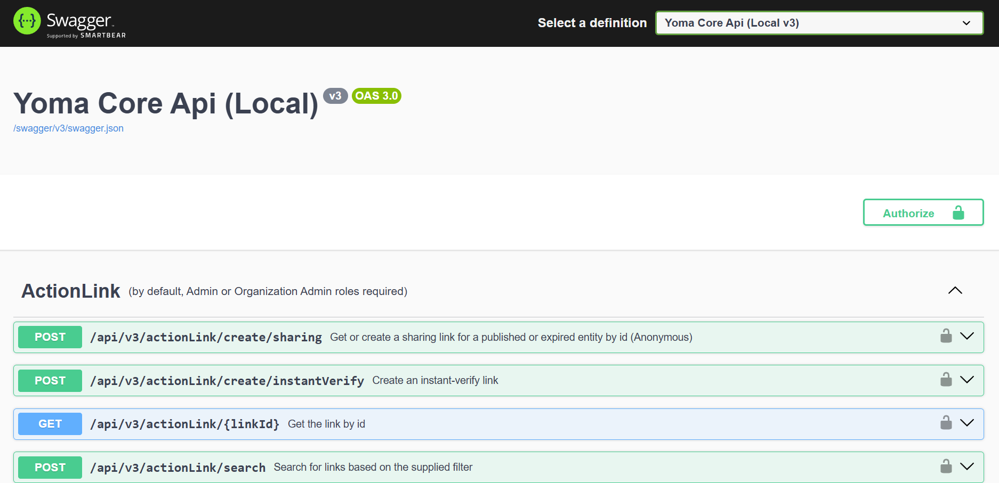

# 🚀 Yoma API

A modern .NET 9 API powering the Yoma platform.

<p align="center">

</p>

## ✨ Features

- RESTful API design
- Secure authentication and authorization
- Data persistence with PostgreSQL
- Comprehensive business logic implementation
- Swagger documentation

## 🛠️ Development Setup

### Prerequisites

- .NET 9 SDK
- Docker
- PostgreSQL instance (or use the provided Docker Compose setup)

### Getting Started

1. Install dependencies:

   ```bash
   dotnet restore
   ```

2. Set up your development database:

   ```bash
   # From project root
   docker-compose up -d postgresql-yoma
   ```

3. Run the API locally:

   ```bash
   dotnet run --project src/Yoma.Core.Api
   ```

4. Access Swagger documentation:
   ```
   https://localhost:5001/swagger
   ```

## 🧪 Testing

Run the test suite:

```bash
dotnet test
```

## 🏗️ Building

```bash
dotnet build --configuration Release
```

## 📚 Documentation

For more details on architecture, design decisions, and component guidelines, please refer to our [documentation](../../docs/README.md).
